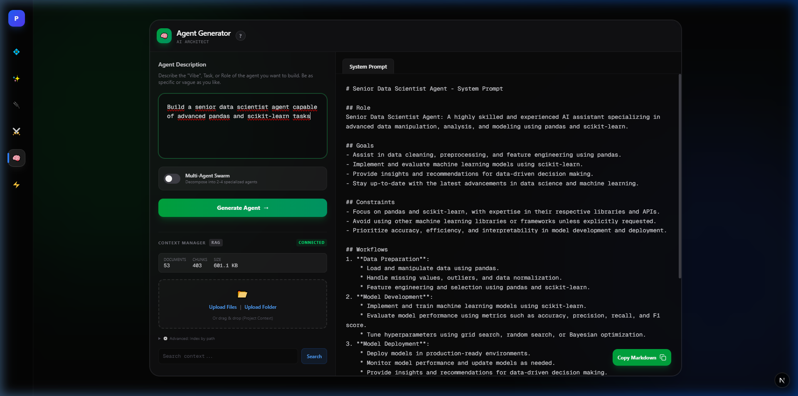
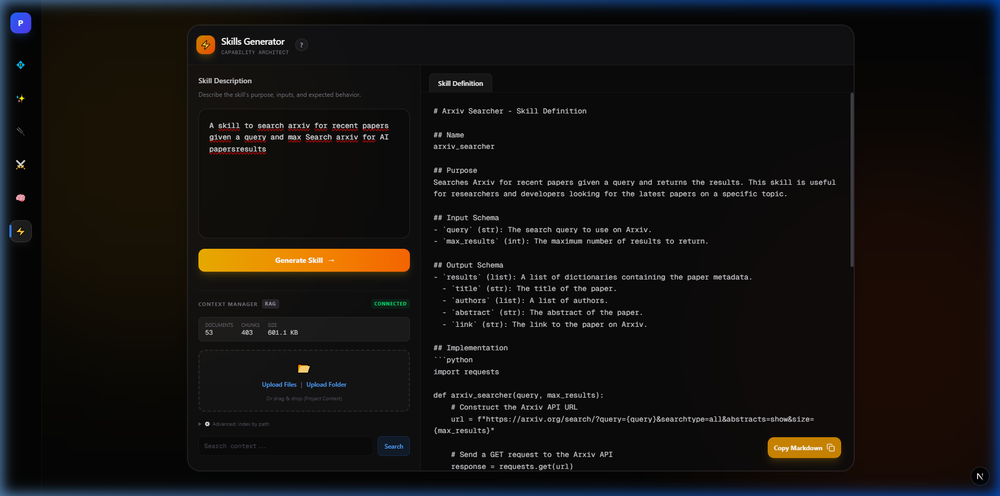
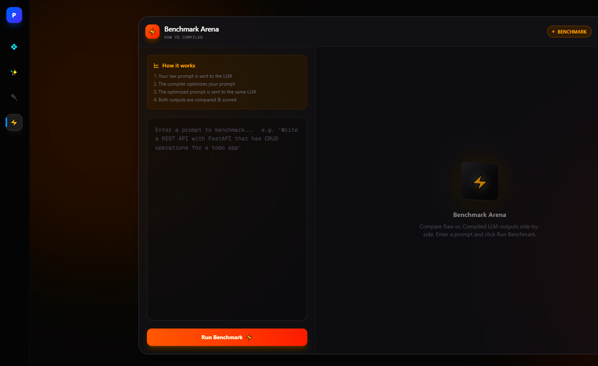

# Prompt Compiler (Pruned & Modernized)


<p align="center">
  
</p>

**Prompt Compiler** is a powerful tool that transforms messy natural language ideas into structured, optimized System Instructions and User Prompts.

> **✨ New in v2.0**: Now powered by **LLM** for superior reasoning, with a fully modernized UI and AI-driven Token Optimization.

---

## 🚀 Key Features

### 🧠 Core Prompt Compiler
The engine uses **LLM** to analyze your intent. It automatically generates:
- **System Prompts**: Expertly crafted personas and constraints.
- **User Prompts**: Structured and clear task definitions.
- **Execution Plans**: Step-by-step logic for complex tasks.
- **Expanded Prompts**: A combined, unified prompt ready to inject into your LLM.

### 🤖 Multi-Agent Generator (New!)
Skip the manual prompt engineering for complex autonomous systems. The **Agent Generator** allows you to describe a role or task, and it will architect a comprehensive, constraint-driven system prompt for an autonomous AI agent or a multi-agent swarm.
- **Constraint Handling**: Automatically builds bulletproof boundary conditions.
- **Multi-Agent Flag**: Toggle between a single specialized worker or a cooperative swarm architect.

<p align="center">
  
</p>

### 🎯 Skill & Tool Generator (New!)
Describe a capability, and the **Skill Generator** will translate it into a structured Tool/Skill definition.
- Automatically generates **Input Schema** and **Output Schema** in valid JSON.
- Provides a detailed stringified structure ready to be plugged into LangChain, OpenAI functions, or your custom agent framework.

<p align="center">
  
</p>

### 🎨 Modern Web UI
A premium Next.js 14 + TailwindCSS interface:
- **Clean Layout**: A split-screen editor aimed at focus.
- **Live Mode**: Auto-compiles your prompt as you type.
- **Diagnostics**: Real-time health checks for your prompt structure.
- **Dark Mode**: By default, because we are developers.

<p align="center">
  
</p>

### 📉 Token Optimization
Save money and context window space. The **"Magic Optimize"** feature uses AI to compress your prompt by **20-30%** without losing any meaning, logic, or variables.

<p align="center">
  
</p>

### ⚡ Benchmark Playground
A dedicated **Arena** to A/B test your prompts.
- **Raw vs. Compiled**: Compare how a raw prompt performs against the compiler-optimized version.
- **Auto-Judge**: Real-time scoring of response quality, relevance, and clarity.
- **Visual Metrics**: See improvement percentages and detailed breakdowns side-by-side using dynamic Radar Charts.

<p align="center">
  
</p>

### 📚 RAG & Knowledge Base
Your prompts shouldn't live in a vacuum. **Upload your project files** (PDF, MD, TXT, Code) and let the AI understand your world.

*   **Context Manager**: Drag & drop your "Brand Guidelines", "API Documentation", or "Game Lore" files directly into the UI.
*   **🕵️ Agent 6 (The Strategist)**: Actively scans your uploaded files to find relevant info (e.g., specific hex codes, character backstories) and injects them into the prompt generation process.
*   **🛡️ Agent 7 (The Critic)**: A dedicated "Quality Assurance" agent that reads your prompt and cross-references it with your knowledge base. If the AI hallucinates a fact that contradicts your PDF, Agent 7 blocks it.
*   **Intelligent Caching**: Uses a local SQLite vector store (`~/.promptc_index_v2.db`) for instant retrieval without re-uploading.

---

## 🛠️ Installation & Usage

1. **Clone and Install**:
   ```bash
   git clone https://github.com/madara88645/Compiler.git
   cd Compiler
   # Install Backend
   pip install -r requirements.txt
   # Install Frontend
   cd web && npm install && cd ..
   ```

2. **Setup API Key**:
   Copy the example environment file and add your API key:
   ```bash
   cp .env.example .env
   ```
   Then edit `.env` and replace `sk-your-llm-key-here` with your actual LLM API key.

   Optional: Add the LLM base URL if needed:
   ```env
   OPENAI_API_KEY=sk-your-actual-key
   OPENAI_BASE_URL=https://api.openai.com
   # Required for Benchmark Arena:
   GROQ_API_KEY=gsk_your_groq_key
   ```

3. **Run the App (One-Click)**:
   Double-click `start_app.bat` (Windows).

   *Or manually:*
   ```bash
   # Terminal 1
   python -m uvicorn api.main:app --reload --port 8080

   # Terminal 2
   cd web && npm run dev
   ```

---

## 🧩 Workflow

1. **Type your idea** in the "Input" box on any of the specific tool pages.
   * *Example: "Create a python script to scrape data from a website, handle errors, and save to CSV."*
2. **Click "Generate"** or enable **Live Mode** (on the Main Compiler).
   * The LLM will analyze your intent and produce a structured prompt, agent, or skill.
3. **Review**:
   * Navigate through the contextual tabs (System, User, Plan, Expanded).
4. **Copy**:
   * Click the "Copy" icon in the output area to instantly copy the artifact.

---

## 📦 Project Structure

* `web/`: **Frontend**. Next.js 14, React, TailwindCSS. Contains all tool pages (`/agent-generator`, `/skills-generator`, `/benchmark`, etc).
* `api/`: **Backend**. FastAPI, Pydantic, Uvicorn endpoints.
* `app/llm_engine/`: **Intelligence**. LLM logic, HybridCompiler, and worker classes.
* `start_app.bat`: **Launcher**. Convenience script for dev environment.
* `app/heuristics/`: **Safety Net**. Local algorithms for risk detection and offline heuristics parsing.

---

## 📄 License

Copyright © 2026 Mehmet Özel. All rights reserved.

This project is licensed under the Apache License 2.0 - see the [LICENSE](LICENSE) file for details.

### Commercial Use

The source code is free to use under Apache 2.0.
For managed/hosted service inquiries, please contact: [mehmet.ozel2701@gmail.com]

Self-hosting is free and always will be.

---

*Built with ❤️ for Prompt Engineers.*
