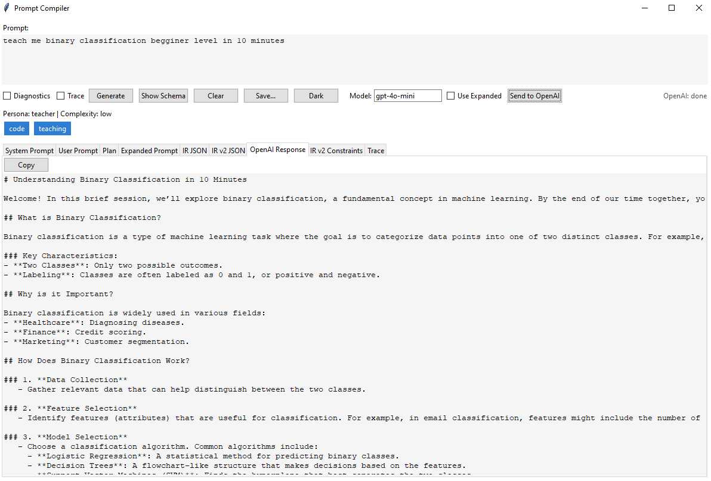
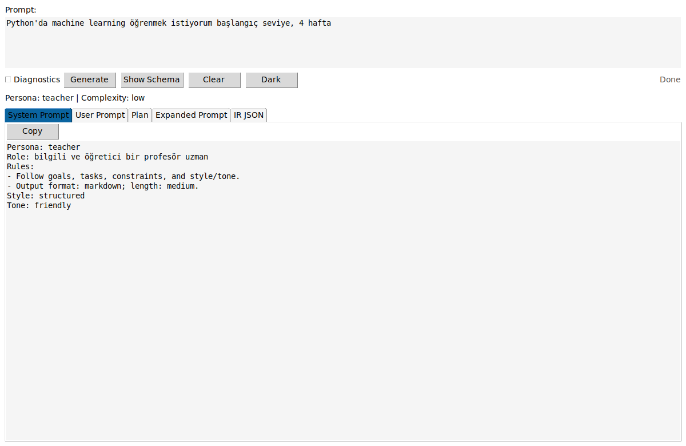
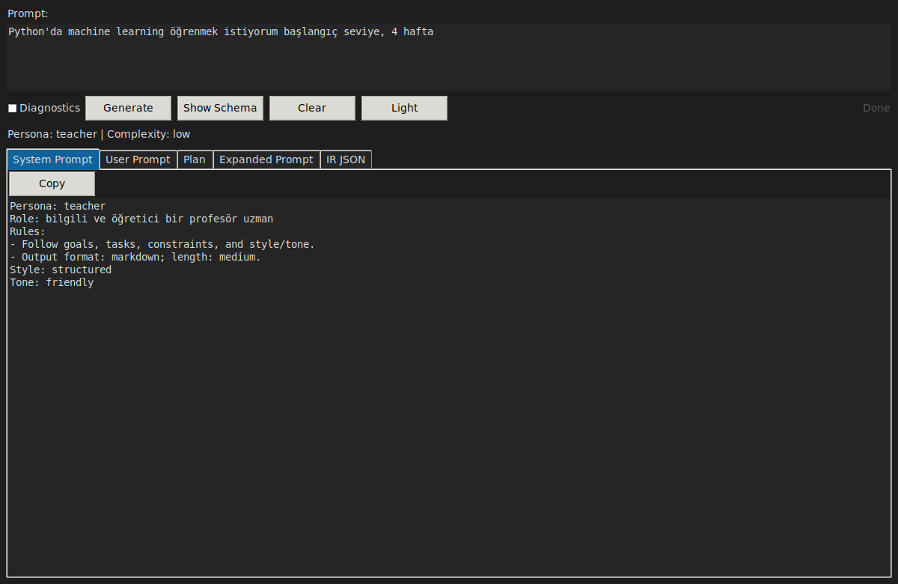

# Prompt Compiler App (promptc)

[](https://github.com/madara88645/Compiler/actions)
[](https://www.python.org/downloads/)
[](https://opensource.org/licenses/MIT)

Compile messy natural language prompts (Turkish / English / Spanish) into a structured Intermediate Representation (IR JSON) and generate optimized System Prompt, User Prompt, Plan, and Expanded Prompt for everyday use with LLMs. (Project documentation below is now fully in English for consistency.)

## Table of Contents
- [Features](#features)
- [Installation](#installation)
- [Usage](#usage)
  - [Command Line Interface (CLI)](#command-line-interface-cli)
  - [API Server](#api-server)
- [Examples](#examples)
- [Intermediate Representation (IR) Schema](#intermediate-representation-ir-schema)
- [What to copy into an LLM?](#what-to-copy-into-an-llm)
- [Project Structure](#project-structure)
- [Use Cases](#use-cases)
- [Development Setup](#development-setup)
 - [Development Setup](#development-setup)
- [Troubleshooting](#troubleshooting)
- [Advanced Features](#advanced-features)
- [Contributing](#contributing)
- [Security](#security)
- [License](#license)

## Features
* **Language Detection**: Automatic detection (Turkish / English / Spanish) with domain guessing and evidence
* **Structured IR**: JSON Schema validated IR with: persona, role, goals, tasks, inputs (interest / budget / format / level / duration), constraints, style, tone, output_format, length_hint, steps, examples, banned, tools, metadata
* **Recency Rule**: Adds `web` tool + recency constraint for time-sensitive queries
* **Teaching Mode**: Detects learning intent; adds instructor persona, level/duration constraints, pedagogical steps, mini quiz scaffold, reputable sources constraint
* **Summary / Comparison / Variants**: Detects summary (with bullet limits), multi-item comparisons (auto switch to table), and variant generation (2–10 distinct variants)
* **Extended Heuristics**: Risk flags (financial / health / legal), entity extraction, complexity score, ambiguous terms -> clarification questions, code request detection
* **Developer Persona (new)**: Coding assistant persona with code-first guidance; auto-detected on coding context (pair-programming, TDD, debug)
* **Live Debug (new)**: Detects "live debug" context and adds constraints for MRE, stack trace analysis, and iterative fix loops; IR v2 `intents` include `debug`
* **Awareness Extensions (new)**: Broader domain/persona/risk/ambiguous keyword coverage (e.g., cloud, security, resilient, secure, portfolio, compliance)
* **Diagnostics Mode**: Optional expanded prompt section (--diagnostics) surfacing risk flags, ambiguous terms, clarify questions
* **Clarification Questions Block**: Auto-added (before diagnostics) when ambiguity detected
* **Assumptions Block**: Adds missing detail filler policy, disclaimer (for risky domains), and variant differentiation rule
* **Multiple Outputs**: System Prompt, User Prompt, Plan, Expanded Prompt, plus raw IR JSON
* **Deterministic & Offline**: No external API calls; reproducible
* **API + CLI + Desktop UI**: FastAPI, Typer CLI, and Tkinter GUI
* **Desktop UI IR v2 helpers (new)**: Intent chips under the summary and an IR v2 Constraints table with copy (plus an "Only live_debug" filter)
* **Desktop UI: IR Diff + Find (new)**: IR v1 vs v2 diff tab and Ctrl+F quick search in the active tab
* **Desktop UI: Export Trace (new)**: One-click export of Trace output from the Constraints tab toolbar
* **Desktop UI: LLM send (new)**: Choose OpenAI or a Local HTTP endpoint, customize models, and review responses in the "LLM Response" tab
* **Desktop UI: Persistent settings (new)**: Theme, Diagnostics, Trace, OpenAI model, Use Expanded, and window size are saved per-user
* **Desktop UI: Export & Copy all (new)**: Per-tab "Export JSON" for IR tabs, "Export MD" for Expanded, and a "Copy all" action for prompt tabs
* **Desktop UI: Recent Prompts Sidebar (new)**: Track and access prompt history with search, favorites (⭐), double-click load, right-click menu, auto-save to `~/.promptc_history.json`
* **Desktop UI: Tags & Snippets (new)**: Organize prompts with 8 color-coded tags (code, writing, analysis, debug, review, tutorial, test, docs), multi-tag filtering, reusable snippet library with CRUD operations, quick insert at cursor
* **Desktop UI: Drag & Drop Files (new)**: Drop .txt/.md files into prompt/context areas with visual indicators, confirmation dialogs, and "📂 Load" buttons
* **Desktop UI: Modern Theme (new)**: Emoji icons on buttons, JSON syntax highlighting, progress bar animation, and tooltips
* **Version Endpoint & CLI**: `/version` API route and `promptc version` command for build visibility
* **Heuristic Version & IR Hash**: Each IR adds `metadata.heuristic_version` and short `metadata.ir_signature`
* **IR v2 (default)**: Rich IR with constraint objects (id/origin/priority), explicit intents, typed steps. CLI defaults to v2 JSON; use `--v1` for legacy. To render prompts using IR v2 emitters, add `--render-v2`. API includes `ir_v2` by default; send `{ "v2": false }` to get only v1.
* **Multi-language emitters (TR/EN/ES)**: System/User/Plan/Expanded prompts render localized section labels for supported languages
* **Plugin architecture (new)**: Load external heuristic packs via Python entry points or `PROMPTC_PLUGIN_PATH`; audit them with `promptc plugins list`
* **Template System (new)**: Reusable prompt templates with variable substitution; built-in templates for code review, tutorials, comparisons, documentation, and debugging
* **Template Management (new)**: Full CRUD operations for custom templates with usage statistics, validation, import/export, and interactive variable input; stored in `~/.promptc/templates/`
* **New CLI Flags**: `--from-file`, `--stdin`, `--fail-on-empty`, `--json-only`, `--quiet`, `--persona`, `--trace`, `--v1`, `--out`, `--out-dir`, `--format`
* **CLI Batch Concurrency (new)**: `batch --jobs N` to compile multiple prompt files in parallel with total & average timing metrics
* **CLI Utilities Enhancements (new)**: `json-path` now supports list indices (`items[0].field`), `diff` supports `--color` & `--sort-keys`, `batch` supports `--jsonl` aggregated IR export and `--stdout` streaming (JSONL / YAML multi-doc / Markdown sections)
* **API Extra Fields**: `/compile` returns `processing_ms`, `request_id`, `heuristic_version`
* **Follow-up Questions**: Expanded Prompt ends with 2 generic next-step questions
* **PII Detection (new)**: Emails / phones / credit cards / IBAN -> `metadata.pii_flags` + privacy constraint
* **Domain Candidates (new)**: Alternative plausible domains surfaced in `metadata.domain_candidates`
* **Domain Confidence (new)**: Ratio of primary domain evidence to total + raw counts (`metadata.domain_confidence`, `metadata.domain_scores`)
* **Temporal & Quantity Extraction (new)**: Detects temporal signals (years, quarters, relative phrases) and numeric quantities with units -> `metadata.temporal_flags`, `metadata.quantities`
* **Structured Clarification Objects (new)**: Rich clarify entries with category + question -> `metadata.clarify_questions_struct`
* **Constraint Origins (new)**: Maps each constraint to its heuristic source -> `metadata.constraint_origins`
* **External Config Overrides (new)**: Optional YAML/JSON patterns file to extend domains, ambiguity, risk keywords without code changes
* **Prompt Analytics & Metrics (new)**: Track prompt compilation history with validation scores, trends over time, domain/persona statistics, and quality improvements; SQLite storage with rich CLI reporting and REST API
* **Prompt History (new)**: Automatic tracking of recent prompt compilations with quick search, domain filtering, and statistics; stored locally in JSON format
* **Export/Import (new)**: Export and import analytics and history data in JSON, CSV, or YAML formats for backup, sharing, and migration; supports date filtering and merge/replace modes
* **Favorites/Bookmarks (new)**: Save your best prompts for quick access with custom tags, notes, use count tracking, and search functionality; local JSON storage with optional clipboard support
* **Quick Snippets (new)**: Reusable prompt fragments for constraints, examples, and context pieces; category-based organization, tag support, usage tracking, and quick insertion into prompts
* **Collections/Workspaces (new)**: Organize related prompts, templates, and snippets into project-based collections with active workspace switching, archiving, and export/import for collaboration; local JSON storage with usage statistics
* **Smart Search (new)**: Unified search engine across all data sources (history, favorites, templates, snippets, collections) with relevance scoring, type filtering, favorites boost, and rich CLI output; supports CSV/JSON export and search statistics
* **Search History & Export (new)**: Automatic tracking of last 10 searches with timestamp and filters; rerun previous searches instantly; export search results to CSV or JSON for reporting and analysis
* **Terminal UI (TUI) (new)**: Modern, interactive full-screen terminal interface built with Textual; features split-pane layout, keyboard navigation (F1-F4), live search, mouse support, and beautiful syntax highlighting for browsing all your prompts
* **Quick Actions & Hotkeys (new)**: Convenient shortcuts for common tasks - `promptc last` to re-run last search, `promptc top` to show highest scored favorites, `promptc random` for inspiration from templates/snippets; all with JSON output support
* **Stats Dashboard (new)**: Comprehensive analytics and statistics dashboard showing overall counts, recent activity (7/30 days), top domains/tags/templates/snippets, quality metrics, daily activity trends with sparklines, and search statistics; supports JSON export and detailed view with ASCII visualizations
* **Comprehensive Test Suite (new)**: 374+ automated tests covering all features including search history (23 tests), TUI components (17 tests), quick actions (21 tests), stats dashboard (28 tests), and all core functionality; 100% passing with full coverage of edge cases and error handling

## Installation

### System Requirements
- Python 3.10 or higher
- pip package manager
 - Pydantic v2 (the project pins `pydantic==2.8.2`)

### Quick Install
```bash
# Clone the repository
git clone https://github.com/madara88645/Compiler.git
cd Compiler

# Create virtual environment (recommended)
python -m venv .venv

# Activate virtual environment
# On Windows (PowerShell):
.\.venv\Scripts\Activate.ps1
# On Linux/Mac:
source .venv/bin/activate

# Install dependencies and the package
pip install -r requirements.txt
pip install -e .

# Verify installation
python -m pytest -q
promptc --help
```

##### Hybrid Retrieval & Context Packing (new)

You can now combine lexical BM25 (FTS5) and embedding similarity using a lightweight hybrid fusion plus pack retrieved chunks into a single context block for downstream LLM calls.

Hybrid search uses a reciprocal-rank fusion (RRF) over separate lexical and embedding result lists, then computes a simple weighted hybrid score:

```
hybrid_score = alpha * norm_bm25 + (1 - alpha) * similarity
```

Where `norm_bm25` is an approximate rank-based normalization and `similarity` is the embedding dot product (since deterministic vectors are L2-normalized). You can tune `--alpha` (default 0.5) to shift emphasis between lexical and semantic signals.

Examples:
```powershell
# Hybrid query (requires index created with --embed)
promptc rag query "gradient descent optimization" --method hybrid --k 8 --alpha 0.4

# Pack top-K hybrid results into a single context under a character budget
promptc rag pack "gradient descent optimization" --k 12 --max-chars 3500 --method hybrid --alpha 0.4

# Save packed context as Markdown
promptc rag pack "gradient descent optimization" --k 8 --format md --out .\out\pack.md

# Control sources section in Markdown output (none | list | full)
promptc rag pack "gradient descent optimization" --k 8 --format md --sources none   # no sources section
promptc rag pack "gradient descent optimization" --k 8 --format md --sources list   # default: filenames
promptc rag pack "gradient descent optimization" --k 8 --format md --sources full   # full path + chunk labels

# Approximate token budget (4 chars ≈ 1 token by default)
promptc rag pack "gradient descent optimization" --k 12 --max-tokens 1200 --token-ratio 4.0 --method hybrid

# Pure lexical packing (no embeddings required)


# Pack output (JSON mode) structure:
```jsonc
{
  "packed": "# file1.txt chunk=0\n...merged text...",
  "included": [ {"path":"/abs/file1.txt","chunk_index":0,"chunk_id":123}, ... ],
  "chars": 1980,
  "query": "gradient descent optimization"
}
```

API equivalents:
```bash
curl -X POST http://127.0.0.1:8000/rag/query \
  -H "Content-Type: application/json" \
  -d '{"query":"gradient descent optimization","method":"hybrid","alpha":0.4,"k":8,"embed_dim":64}'

curl -X POST http://127.0.0.1:8000/rag/pack \
  -H "Content-Type: application/json" \
  -d '{"query":"gradient descent optimization","method":"hybrid","alpha":0.4,"k":12,"max_chars":3500,"max_tokens":1200,"token_ratio":4.0,"embed_dim":64}'
```

Notes & Limitations:
- Hybrid falls back gracefully if embeddings are absent (acts like lexical only; still returns `hybrid_score`).
- Packing currently uses stored snippets (first 200 chars per chunk) rather than reloading full chunk text to stay fast; you can adjust this in code (`simple_index.pack`).
- Character budget is a simple `len()` check (Python characters ≈ UTF-8 bytes for ASCII content). Adjust margin if mixing wide Unicode.
- Token budget is approximate: tokens ≈ chars / token_ratio (default 4.0). For more accuracy, plug in a tokenizer later.
- No cache invalidation: the in-process LRU (capacity 64) may return stale results if you ingest new docs after querying in the same session. Restart process or bump cache key strategy if this matters.
- Deterministic embeddings are intentionally simplistic; for production use, swap `_simple_embed` with a real model and keep the public function signatures stable.

Planned (future): scored context packing with de-duplication, pluggable embedding backends, optional re-ranking, and token-aware packing (tiktoken/approximate tokenizer).
### Run API
```powershell
uvicorn api.main:app --reload
```
Health: http://127.0.0.1:8000/health (alias: `/healthz`)  •  Version: http://127.0.0.1:8000/version

## Usage

### Terminal User Interface (TUI) - NEW! 🎨

**Modern, interactive terminal UI** for searching and browsing your prompts:

```bash
# Launch the TUI
promptc tui
```

**Features:**
- 🔍 **Live Search**: Real-time search across all data sources
- ⌨️ **Keyboard Navigation**: Full keyboard support (Arrow keys, Tab, Enter)
- 📋 **Split View**: Results list + detailed preview pane
- 🎯 **Quick Filters**: F2=History, F3=Favorites, F4=Collections
- 🎨 **Modern UI**: Beautiful terminal interface with rich colors
- 🖱️ **Mouse Support**: Click to select and navigate
- ⚡ **Fast**: Instant results with relevance scoring

**Keyboard Shortcuts:**
- `F1` - Focus on search
- `F2` - Show only history
- `F3` - Show only favorites
- `F4` - Show only collections
- `Ctrl+C` - Quit
- `Tab` / `Shift+Tab` - Navigate between panels
- `↑` / `↓` - Navigate results
- `Enter` - Select result

**Requirements:**
```bash
pip install textual  # Auto-installed with requirements.txt
```

### Command Line Interface (CLI)

The CLI is the fastest way to compile prompts:

```bash
# Basic usage
promptc "teach me gradient descent in 15 minutes at intermediate level"

# Multiple word prompt (quotes recommended)
promptc "explain quantum computing concepts for beginners"

# With diagnostics (risk & ambiguity insights)
promptc --diagnostics "Analyze stock market investment strategy and optimize performance"

# Developer & Live Debug examples
promptc compile "Let’s pair program. TDD implement normalize_whitespace(text) with pytest tests" --json-only
promptc compile "Live debug this Python error and create an MRE" --json-only --trace

# Read prompt from a file or STDIN (Windows PowerShell)
promptc --from-file .\examples\example_en.txt --json-only
promptc compile --from-file .\examples\example_tr.txt --v1 --diagnostics
Get-Content .\examples\example_en.txt | promptc compile --stdin --json-only
echo "  " | promptc compile --stdin --fail-on-empty

# Save outputs to files
# Save IR v2 JSON next to current directory
promptc "teach me gradient descent" --json-only --out result.json

# Save multiple runs into a directory with auto names
promptc compile --from-file .\examples\example_en.txt --out-dir .\outputs --format json
promptc compile --from-file .\examples\example_en.txt --out-dir .\outputs --format md
promptc compile --from-file .\examples\example_tr.txt --out-dir .\outputs --format md --v1

# Render prompts using IR v2 emitters (system/user/plan/expanded)
promptc "compare llama3 vs gpt-4o for code generation" --render-v2
```

#### Prompt Validation (new)

Validate prompt quality and get actionable suggestions before sending to LLMs:

```powershell
# Validate a prompt and get quality score
promptc validate-prompt "Write a tutorial about Python"

# Validate from file
promptc validate-prompt --from-file prompt.txt

# Get JSON output
promptc validate-prompt "teach me gradient descent" --json

# Hide suggestions/strengths
promptc validate-prompt "code review task" --no-suggestions --no-strengths

# Fail if score below threshold (useful in CI/CD)
promptc validate-prompt --from-file prompt.txt --min-score 70

# Save report to file
promptc validate-prompt "create docs" --out validation_report.txt

# Read from stdin
cat prompt.txt | promptc validate-prompt --stdin
```

**What it checks:**
- **Clarity**: Vague terms, ambiguous language, generic personas
- **Specificity**: Domain detection, role definition, overly broad goals
- **Completeness**: Missing examples, constraints, output formats
- **Consistency**: Conflicting constraints, tone/persona mismatches

**Example output:**
```
═══ Prompt Quality Report ═══

Overall Score: 72.5/100

Breakdown:
  • Clarity:       85.0/100
  • Specificity:   70.0/100
  • Completeness:  65.0/100
  • Consistency:   90.0/100

Issues Found: 0 errors, 3 warnings, 2 info

⚠ WARNING (completeness)
  Complex task without examples
  💡 Add examples to clarify expected output format

✓ Strengths:
  ✓ Well-defined persona: 'senior python developer'
  ✓ Clear constraints (4 defined)
  ✓ Specific output format: markdown
```

#### Auto-Fix (new)

Automatically improve prompts based on validation issues:

```powershell
# Fix a poor-quality prompt
promptc fix "do something with stuff"
# → Replaces vague terms, adds persona, improves structure

# Fix from file and apply changes
promptc fix --from-file prompt.txt --apply

# Set target score and limit fixes
promptc fix "write code" --target-score 80 --max-fixes 5

# Save fixed prompt to new file
promptc fix --stdin --out fixed_prompt.txt --no-diff

# JSON output for programmatic use
promptc fix "maybe analyze data" --json
```

**What it fixes:**
- 🔧 **Vague terms**: Replaces "something", "stuff", "maybe" with specific alternatives
- 👤 **Missing persona**: Adds domain-appropriate persona (e.g., "senior data scientist")
- 📝 **Missing examples**: Adds example sections for complex tasks
- 📋 **Output format**: Specifies clear output format expectations
- ⚠️ **Risk mitigation**: Adds safety constraints for risky domains
- 🎓 **Teaching specs**: Adds level specifications for educational prompts

**Example:**
```
=== Auto-Fix Report ===

Original Score: 42.0/100
Fixed Score:    78.5/100
Improvement:    +36.5 (86.9%)

Applied 3 fix(es):

1. [replace_vague] Replaced vague terms: 'something' → 'a specific component', 'stuff' → 'data'
   Confidence: 95%

2. [add_persona] Added persona: 'expert consultant'
   Confidence: 85%

3. [add_format] Added output format specification
   Confidence: 90%

✓ All issues resolved!
```

#### RAG (lightweight, local)

Index local text sources and query them with a minimal SQLite FTS5-based retriever. No external dependencies.

```powershell
# Index files or folders (default db: ~/.promptc_index.db)
promptc rag index .\docs .\examples --ext .txt --ext .md

# Query the index (JSON/YAML/Markdown)
promptc rag query "gradient descent learning rate" --k 5
promptc rag query "gradient descent" --k 5 --format yaml
promptc rag query "gradient descent" --k 5 --format md --out .\out\query.md
promptc rag query "gradient descent" --k 10 --method fts --min-score 10.0 --json
promptc rag query "gradient descent" --k 10 --method embed --min-sim 0.35 --json
promptc rag query "gradient descent optimization" --method hybrid --alpha 0.4 --k 12 --min-hybrid 0.25 --json

# Custom database path and JSON output
promptc rag query "teaching persona" --db-path .\myindex.db --json

# Show index statistics
promptc rag stats --db-path .\myindex.db
promptc rag stats --db-path .\myindex.db --json

# Prune records for deleted files
promptc rag prune --db-path .\myindex.db
promptc rag prune --db-path .\myindex.db --json
```

Notes:
 - `rag stats` summarizes docs, chunks, total/avg bytes, and largest sources.
 - `rag prune` removes entries whose source files disappeared.

#### Analytics (new)

Track prompt compilation history, validation scores, quality trends, and domain/persona statistics:

```powershell
# Record a prompt with automatic validation
promptc analytics record prompt.txt

# Record without validation
promptc analytics record prompt.txt --no-validate

# View summary for last 30 days
promptc analytics summary

# Custom time period and filters
promptc analytics summary --days 7 --domain education
promptc analytics summary --days 90 --persona teacher --json

# Score trends over time
promptc analytics trends --days 30

# Domain-specific statistics
promptc analytics domains --days 30 --json

# List recent prompts
promptc analytics list --limit 20
promptc analytics list --domain tech --min-score 80

# Overall database statistics
promptc analytics stats

# Clean old records (keep last 90 days)
promptc analytics clean --days 90 --force
```

#### History (new)

Track recent prompt compilations with automatic history logging:

```powershell
# List recent prompts (automatically saved during compilation)
promptc history list --limit 20

# Filter by domain
promptc history list --domain education

# Search history
promptc history search "Python tutorial"

# Show full details of a specific entry
promptc history show abc12345

# View history statistics
promptc history stats

# Clear all history
promptc history clear --force

# JSON output
promptc history list --json
```

**Example Output:**
```
Prompt History (Last 10)

ID          Date        Score  Domain        Lang  Prompt
──────────  ──────────  ─────  ────────────  ────  ──────────────────────────────────
c99c6aa4    2025-10-07   97.5  ai/ml         EN    Generate a concise JSON summary...
8f2d1bc3    2025-10-07   82.3  education     EN    Teach me Python basics in 30 min...
a5b9e7f1    2025-10-06   78.0  tech          TR    Web uygulaması nasıl yapılır...
d3c8a2e9    2025-10-06   91.2  creative      EN    Write a short story about AI...
```

**Features:**
- Automatic tracking of all compilations
- Max 100 entries (configurable)
- Search by text, filter by domain
- Stores domain, language, score, timestamp
- Local JSON storage (~/.promptc/history.json)
- No external dependencies

#### Export/Import (new)

Export and import your analytics and history data for backup, sharing, or migration:

```powershell
# Export all data to JSON (default)
promptc export data backup.json

# Export only analytics to CSV
promptc export data analytics.csv --type analytics --format csv

# Export only history to YAML
promptc export data history.yaml --type history --format yaml

# Export with date filtering
promptc export data recent.json --start 2025-10-01 --end 2025-10-07

# Import data (merge with existing)
promptc export import backup.json

# Import and replace existing data
promptc export import backup.json --replace

# Import only analytics
promptc export import analytics.csv --type analytics

# Create timestamped backup
promptc export backup
promptc export backup --dir ./my-backups --format yaml

# JSON output for scripting
promptc export data export.json --json
```

**Supported Formats:**
- **JSON**: Full structure with metadata (recommended for complete backups)
- **CSV**: Flat format, creates separate files for analytics and history when exporting both
- **YAML**: Human-readable format (requires `pyyaml`)

**Features:**
- Export/import analytics and history separately or together
- Date range filtering for exports
- Merge or replace modes for imports
- Automatic deduplication by prompt hash
- Preserves all metadata and timestamps
- Cross-platform compatible

**Use Cases:**
- 🔄 Backup before system changes
- 📤 Share prompt libraries with team
- 🔀 Migrate between machines
- 📊 Analyze data in external tools (Excel, Python)
- 🗄️ Archive old data

**Example Output:**
```
╭─────────── Export Complete ───────────╮
│ ✓ Export successful                   │
│                                        │
│ File: backup.json                      │
│ Format: json                           │
│ Type: both                             │
│ Analytics: 42 records                  │
│ History: 87 entries                    │
│ Export Date: 2025-10-08T10:30:00      │
╰────────────────────────────────────────╯
```

#### Collections/Workspaces (new)

Organize related prompts, templates, and snippets into project-based collections:

```powershell
# Create a new collection
promptc collections create ml-project \
  --name "Machine Learning Project" \
  --description "Resources for ML tutorial series" \
  --tag "ml" --tag "python" \
  --color "green" \
  --active

# List all collections
promptc collections list

# Filter by tag
promptc collections list --tag ml

# Show only active (non-archived) collections
promptc collections list --archived false

# Show collection details
promptc collections show ml-project

# Switch to a collection (set as active workspace)
promptc collections switch ml-project

# Add items to collection
promptc collections add-prompt ml-project abc123
promptc collections add-template ml-project tutorial_creator
promptc collections add-snippet ml-project ml-basics

# Remove items from collection
promptc collections remove-prompt ml-project abc123
promptc collections remove-template ml-project old-template
promptc collections remove-snippet ml-project outdated-snippet

# Update collection metadata
promptc collections update ml-project \
  --name "Advanced ML Project" \
  --description "Updated description" \
  --tag "advanced" --tag "pytorch" \
  --color "purple"

# Archive/unarchive collections
promptc collections archive old-project
promptc collections unarchive ml-project

# Show statistics
promptc collections stats

# Export collection
promptc collections export ml-project --output ml-project.json

# Import collection
promptc collections import ml-project.json

# Import with overwrite
promptc collections import shared-project.json --overwrite

# Delete collection
promptc collections delete old-project

# Clear all collections
promptc collections clear --force

# JSON output
promptc collections list --json
promptc collections show ml-project --json
```

**Features:**
- Project-based organization for prompts, templates, and snippets
- Active workspace concept (switch between projects)
- Archive inactive collections
- Export/import for collaboration and backup
- Usage statistics and tracking
- Tag-based filtering
- Color coding for UI display
- Automatic timestamp tracking
- Local JSON storage (~/.promptc/collections.json)

**Example List Output:**
```
Collections (5 total)

ID            Name                    Items  Tags            Status    Used
────────────  ──────────────────────  ─────  ──────────────  ────────  ────
ml-project    Machine Learning        12     ml, python      ●Active     25
web-dev       Web Development         8      web, js
tutorial      Tutorial Series         15     education                    8
archive-2024  Archive 2024            45     archive         Archived
research      Research Project        6      research, ai                 3
```

**Example Show Output:**
```
╭────────── Collection: Machine Learning Project ──────────╮
│ Name: Machine Learning Project                          │
│ ID: ml-project                                           │
│ Description: Resources for ML tutorial series           │
│ Tags: ml, python, advanced                               │
│ Color: green                                             │
│ Created: 2024-10-12T10:30:00                            │
│ Updated: 2024-10-12T15:45:00                            │
│ Use Count: 25                                            │
│ Active: Yes                                              │
│ Archived: No                                             │
╰──────────────────────────────────────────────────────────╯

Items
──────────  ─────  ─────────────────────────────────────
Type        Count  IDs
──────────  ─────  ─────────────────────────────────────
Prompts         5  abc123, def456, ghi789...
Templates       4  tutorial_creator, code_review...
Snippets        3  ml-basics, pytorch-example...
──────────  ─────  ─────────────────────────────────────
```

**Statistics Output:**
```
╭────────── Collection Statistics ──────────╮
│ Total Collections: 5                      │
│ Active Collections: 4                     │
│ Archived Collections: 1                   │
│                                           │
│ Total Prompts: 35                         │
│ Total Templates: 12                       │
│ Total Snippets: 18                        │
│                                           │
│ Active Collection: ml-project             │
╰───────────────────────────────────────────╯

Most Used Collections
────  ─────────────────  ─────  ─────
ID    Name              Uses   Items
────  ─────────────────  ─────  ─────
ml-…  Machine Learning    25     12
tut…  Tutorial Series      8     15
res…  Research Project     3      6
────  ─────────────────  ─────  ─────
```

**Use Cases:**
- **Project Organization**: Group all ML tutorial prompts, templates, and snippets together
- **Team Collaboration**: Export collections and share with team members
- **Context Switching**: Quickly switch between work, personal, and research projects
- **Archive Management**: Archive old projects while keeping them accessible
- **Workflow Tracking**: Monitor which collections you use most frequently

**Storage Location:**
- Collections: `~/.promptc/collections.json`
- Active workspace: `~/.promptc/active_collection.txt`

#### Smart Search (new)

Unified search across all your PromptC data sources with relevance scoring:

```powershell
# Search across all data sources
promptc search "machine learning tutorial"

# Search specific types
promptc search "classification" --type history
promptc search "review" --type template
promptc search "pytorch" --type snippet
promptc search "ml" --type collection

# Search multiple types
promptc search "python" --type history --type snippet

# Limit results
promptc search "optimization" --limit 5

# Set minimum score threshold (0-100)
promptc search "api" --min-score 60

# Get JSON output
promptc search "neural network" --json

# Show search statistics
promptc search --stats
```

**Search Features:**
- **Unified Search**: Search across history, favorites, templates, snippets, and collections
- **Relevance Scoring**: Smart scoring algorithm (exact match=100, all words=80, partial=60)
- **Favorites Boost**: Favorite items get 1.1x score boost
- **Type Filtering**: Search specific data sources or all at once
- **Rich Output**: Beautiful table output with emoji icons per type (📝📄📋⭐🗂️)
- **JSON Export**: Machine-readable output for automation
- **Statistics**: View searchable item counts across all sources
- **Case Insensitive**: Searches work regardless of letter case
- **Multi-word Search**: Finds items matching all or some words
- **Tag Search**: Searches through item tags

**Example Search Output:**
```
Search Results (5 matches)

Type        Score  Title                                     Content Preview
──────────  ─────  ────────────────────────────────────────  ─────────────────────────────────────────
⭐Favorite     95  Create a neural network tutorial...       Create a neural network tutorial for...
📝History      85  Explain backpropagation algorithm         Explain backpropagation algorithm in...
📋Template     80  tutorial_creator                          Create a comprehensive tutorial on...
📄Snippet      75  ml-basics                                 Basic machine learning concepts and...
🗂️Collection  70  ml-project                                Machine Learning Project resources...
```

**Statistics Output:**
```
╭────────── Search Statistics ──────────╮
│ Total Searchable Items: 247           │
│                                       │
│ History Entries: 87                   │
│ Favorites: 23                         │
│ Templates: 45                         │
│ Snippets: 67                          │
│ Collections: 25                       │
╰───────────────────────────────────────╯
```

**Export Results:**
```powershell
# Export as JSON
promptc search "machine learning" --export results.json

# Export as CSV
promptc search "python tutorial" --export results.csv

# Export with filters
promptc search "api" --type snippet --min-score 70 --export filtered.json
```

**Search History (new):**
```powershell
# View recent searches (last 10)
promptc search-history

# Rerun a previous search
promptc search-history --rerun 0

# Clear search history
promptc search-history --clear

# Get history as JSON
promptc search-history --json
```

**Quick Actions & Hotkeys (new):** ⚡
```powershell
# Show and re-run last search
promptc last

# Show top favorites by score
promptc top
promptc top --limit 5

# Get random template or snippet for inspiration
promptc random
promptc random --type template
promptc random --type snippet

# All support JSON output
promptc last --json
promptc top --json
promptc random --json
```

**Stats Dashboard (new):** 📊
```powershell
# Show overall statistics
promptc stats

# Show detailed stats with all metrics
promptc stats --detailed

# Stats for specific time period
promptc stats --period 7d   # Last 7 days
promptc stats --period 30d  # Last 30 days
promptc stats --period all  # All time

# Export stats as JSON
promptc stats --json
promptc stats --detailed --json

# Combine options
promptc stats --period 30d --detailed --json
```

**Stats Dashboard displays:**
- **Overview**: Total counts for prompts, favorites, templates, snippets, collections, searches
- **Recent Activity**: Prompts created, favorites added, searches performed in selected period
- **Quality Metrics**: Average score, high quality count (score ≥ 8.0), high quality percentage
- **Activity Trend**: 14-day sparkline visualization of daily activity
- **Top Domains**: Most common domains with ASCII bar chart (top 5)
- **Top Tags**: Most frequently used tags across all items (detailed mode only)
- **Most Used**: Top templates and snippets (top 3 each)
- **Search Activity**: Total searches, average results per search, most common queries
- **Helpful Tips**: Quick reminders for key commands

**Use Cases:**
- **Quick Retrieval**: Find that perfect prompt you used last week
- **Discovery**: Discover related templates and snippets across projects
- **Quality Check**: Find your best prompts (high scores in favorites)
- **Cross-Reference**: See all resources related to a topic
- **Automation**: Export search results as JSON/CSV for scripts
- **Efficiency**: Quickly rerun previous searches without retyping
- **Inspiration**: Get random suggestions to spark creativity
- **Analytics**: Track your prompt usage patterns and quality trends over time
- **Insights**: Identify most used domains, tags, templates, and snippets
- **Monitoring**: Keep track of recent activity and search behavior

**Search Algorithm:**
- **Exact Match**: Full query matches content → Score 100
- **All Words**: All query words present → Score 80
- **Partial Match**: Some query words present → Score 60
- **Favorites Boost**: Favorite items get 10% score increase
- **Multi-field**: Searches titles, content, tags, notes, descriptions

**Storage:**
- Search history: `~/.promptc/search_history.json` (last 10 searches)

#### Template Management (new)

Manage reusable prompt templates with variables:

```powershell
# List all available templates
promptc template list

# List with details
promptc template list --details

# Filter by category or tag
promptc template list --category coding
promptc template list --tag python

# Search templates
promptc template list --search "code review"

# Show template details
promptc template show code-review

# Show with preview and validation
promptc template show code-review --preview --validate

# Create a new custom template
promptc template create my-template \
  --name "My Custom Template" \
  --description "A custom template for my use case" \
  --category custom \
  --text "Hello {{name}}, your {{item}} is ready!" \
  --tags "greeting,custom" \
  --author "Your Name"

# Create template from file
promptc template create my-template \
  --name "File Template" \
  --description "Template from file" \
  --category custom \
  --from-file template.txt

# Use a template (provide variables)
promptc template use code-review --var language=Python --var file=app.py

# Interactive mode (prompts for each variable)
promptc template use tutorial --interactive

# Use with compilation
promptc template use tutorial --var topic=Python --compile

# Copy result to clipboard
promptc template use code-review --var language=JavaScript --copy

# Edit a template
promptc template edit my-template --name "Updated Name" --tags "new,tags"

# Update template text from file
promptc template edit my-template --from-file new_template.txt

# Delete a template (user templates only)
promptc template delete my-template

# Delete with force (skip confirmation)
promptc template delete my-template --force

# List all categories
promptc template categories

# Show usage statistics
promptc template stats

# Show stats for specific template
promptc template stats code-review

# Export a template to YAML
promptc template export my-template --output my-template.yaml

# Import a template from YAML
promptc template import my-template.yaml

# Validate a template
promptc template validate my-template

# JSON output
promptc template list --json
```

**Example Template Usage:**

```powershell
# Create a code review template
promptc template create code-review-detailed \
  --name "Detailed Code Review" \
  --description "In-depth code review with best practices" \
  --category coding \
  --text "Review this {{language}} code in file {{file}}. Focus on: security, performance, readability, and {{focus}}. Provide specific recommendations." \
  --tags "code,review,quality"

# Use it
promptc template use code-review-detailed \
  --var language=Python \
  --var file=main.py \
  --var focus="error handling" \
  --compile

# View statistics
promptc template stats code-review-detailed
```

**Template Features:**
- **Variable Substitution**: Use `{{variable}}` placeholders in template text
- **Required/Optional Variables**: Mark variables as required or provide defaults
- **Categories & Tags**: Organize templates for easy discovery
- **Usage Tracking**: Track how many times each template is used
- **Import/Export**: Share templates with your team via YAML files
- **Validation**: Automatically detect undefined variables or issues
- **Interactive Mode**: Prompt for variable values interactively
- **Compile Integration**: Directly compile rendered templates

**Storage Location:**
- Built-in templates: `templates/` directory in the project
- Custom templates: `~/.promptc/templates/`
- Usage statistics: `~/.promptc/template_stats.json`

#### Quick Snippets (new)

Manage reusable prompt fragments for quick insertion:

```powershell
# Add a new snippet
promptc snippets add my-constraint \
  --title "Security Constraint" \
  --content "Ensure code follows OWASP security guidelines" \
  --category constraint \
  --tags "security,owasp"

# Add from file
promptc snippets add example-snippet \
  --title "API Example" \
  --from-file examples/api_usage.txt \
  --category example \
  --tags "api,rest"

# List all snippets
promptc snippets list

# Filter by category or tags
promptc snippets list --category constraint
promptc snippets list --tags security

# Search snippets
promptc snippets search "OWASP"

# Show full snippet details
promptc snippets show my-constraint

# Use a snippet (increments count, shows content)
promptc snippets use my-constraint

# Use and copy to clipboard
promptc snippets use my-constraint --copy

# Edit a snippet
promptc snippets edit my-constraint \
  --title "Updated Security Constraint" \
  --tags "security,owasp,updated"

# Add/remove tags
promptc snippets tag my-constraint critical
promptc snippets untag my-constraint old

# Delete a snippet
promptc snippets delete my-constraint

# Show statistics
promptc snippets stats

# Show most used snippets
promptc snippets most-used --limit 10

# List categories
promptc snippets categories

# Clear all snippets
promptc snippets clear --force

# JSON output
promptc snippets list --json
```

**Common Categories:**
- `constraint`: Requirements, rules, guidelines
- `example`: Code examples, sample outputs
- `context`: Background information, domain knowledge
- `persona`: Role definitions, expertise descriptions
- `style`: Tone, format, writing style instructions

**Example Usage:**

```powershell
# Create a set of common constraints
promptc snippets add security-basics \
  --title "Security Basics" \
  --content "Follow OWASP Top 10, validate all inputs, use parameterized queries" \
  --category constraint \
  --tags "security,basics"

promptc snippets add code-quality \
  --title "Code Quality Standards" \
  --content "Use meaningful names, keep functions small (<20 lines), write tests" \
  --category constraint \
  --tags "quality,best-practices"

# Create helpful examples
promptc snippets add rest-api-example \
  --title "REST API Example" \
  --content "GET /api/users/{id} - Returns user by ID, POST /api/users - Creates new user" \
  --category example \
  --tags "api,rest,http"

# Use snippets in your prompts
promptc snippets use security-basics --copy
# Then paste into your prompt compilation
```

**Features:**
- Quick access to reusable prompt fragments
- Category-based organization
- Tag support for flexible filtering
- Usage tracking and statistics
- Search across title, content, and tags
- Multi-language support

**Storage Location:**
- Snippets: `~/.promptc/snippets.json`

#### Favorites/Bookmarks (new)

Save your best prompts for quick access with favorites:

```powershell
# Add a prompt to favorites from history
promptc favorites add abc123 --tags "python,tutorial" --notes "Best tutorial prompt"

# List all favorites
promptc favorites list

# Filter by tags or domain
promptc favorites list --tags python
promptc favorites list --domain education

# Search favorites
promptc favorites search "tutorial"

# Show full details
promptc favorites show abc123

# Use a favorite (increments count, shows prompt, copies to clipboard)
promptc favorites use abc123

# Add/remove tags
promptc favorites tag abc123 important
promptc favorites untag abc123 old

# Update notes
promptc favorites note abc123 "Updated description"

# Show statistics
promptc favorites stats

# Show most used favorites
promptc favorites most-used --limit 5

# Remove a favorite
promptc favorites remove abc123

# Clear all favorites
promptc favorites clear --force

# JSON output
promptc favorites list --json
```

**Features:**
- Bookmark best prompts from history
- Custom tags and notes for organization
- Use count tracking
- Search by text, tags, or notes
- Filter by domain or tags
- Most-used favorites ranking
- Local JSON storage (~/.promptc/favorites.json)
- Optional clipboard support (pip install pyperclip)

**Example Output:**
```
Favorites (12 total)

ID          Score  Domain      Tags                 Uses  Prompt
──────────  ─────  ──────────  ───────────────────  ────  ────────────────────────────────
f8a9c2b1     97.5  education   python, tutorial       15  Teach me Python basics in 30 min
d3e4f5a6     92.0  tech        comparison, ML          8  Compare scikit-learn vs PyTorch
a1b2c3d4     88.5  creative    writing, story          5  Write a short story about AI
```

**Statistics:**
```
╭──────── Favorites Statistics ────────╮
│ Total Favorites: 12                  │
│ Total Uses: 45                       │
│ Avg Score: 89.2                      │
│                                      │
│ Top Domains:                         │
│   education: 5                       │
│   tech: 4                            │
│   creative: 3                        │
│                                      │
│ Top Tags:                            │
│   python: 6                          │
│   tutorial: 4                        │
│   comparison: 3                      │
│                                      │
│ Languages:                           │
│   EN: 10                             │
│   TR: 2                              │
╰──────────────────────────────────────╯
```

**Example Output:**
```
Analytics Summary (Last 30 days)

Overview
────────────────────────────────────
Total Prompts      42
Avg Score          78.5 ± 8.3
Score Range        58.0 → 95.0
Avg Issues         2.3
Avg Length         284 chars
Improvement        ↑ 12.5%

Top Domains:
  education      18
  tech          12
  creative       8
  general        4

  Most Improved: education

Top Personas:
  teacher       15
  assistant     14
  expert         8
  coach          5

Languages:
  en: 28
  tr: 14

Top Intents:
  teach         22
  explain       18
  answer        15
  create        12
  debug          8
```

##### Embedding Retrieval (minimal, optional)

You can enable a tiny deterministic embedding mode (no external models) to get simple semantic similarity ranking:

```powershell
# Ingest computing embeddings (stores vectors alongside chunks)
promptc rag index .\docs --embed

# Query using embeddings (cosine similarity)
promptc rag query "gradient descent optimization" --method embed --k 5

# Mixed usage: you can still run lexical queries on the same DB
promptc rag query "gradient descent optimization" --method fts --k 5
```

Details:
- Embeddings are 64-dim bag-of-token-hash vectors (L2 normalized) created via a deterministic lightweight function.
- No external dependencies or network calls; suitable for quick local semantic-ish matching.
- Must ingest with `--embed` first; otherwise `--method embed` will return zero results (no vectors stored).
- You can adjust dimension with `--embed-dim N` (same value required at query time).
- Scores for embedding search display similarity (`sim=`). JSON results include both `similarity` (dot product) and `score` (1 - similarity for ordering consistency).
- Intended as a starter path toward adding real model-based embeddings later; keeps default footprint minimal.

API equivalents:
```bash
curl -X POST http://127.0.0.1:8000/rag/ingest \
  -H "Content-Type: application/json" \
  -d '{"paths":["docs"],"embed":true}'

curl -X POST http://127.0.0.1:8000/rag/query \
  -H "Content-Type: application/json" \
  -d '{"query":"gradient descent optimization","method":"embed"}'
```

Planned (future): weighted hybrid fusion (BM25 + embedding), context packing for token budgets, pluggable external embedding providers.

#### Template System (new)

Reusable prompt templates with variable substitution for common use cases:

```powershell
# List all available templates
promptc template list

# Filter by category
promptc template list --category development

# Show template details
promptc template show code-review

# Apply template with variables
promptc template apply code-review -v "language=Python" -v "context=REST API authentication"

# Use example values from template
promptc template apply tutorial-creator --example

# Apply without compiling (just render)
promptc template apply bug-analyzer -v "system=FastAPI app" -v "issue=500 errors" --no-compile

# Create custom template
promptc template create my-analysis --name "My Analysis" --desc "Custom analysis template" --category analysis --interactive

# Delete user template
promptc template delete my-analysis
```

**Built-in templates:**
- `code-review`: Comprehensive code review prompts (any language)
- `tutorial-creator`: Structured tutorials with learning objectives
- `tech-comparison`: Side-by-side technology/framework comparison
- `documentation-writer`: Technical documentation (API, guides, README)
- `bug-analyzer`: Systematic debugging and root cause analysis

Templates support:
- Variable placeholders with `{{variable_name}}`
- Required and optional variables with defaults
- Example values for quick testing
- Category-based organization
- User-defined custom templates saved in `~/.promptc/templates/`

#### CLI extras (new)

Common utilities to help with validation, comparison, and bulk runs:

```powershell
# Validate IR JSON against schema (default: v2; switch to --v1 for legacy)
promptc validate .\outputs\ir.json
promptc validate --v1 .\outputs\ir_v1.json

# Diff two IR JSON files (unified diff)
promptc diff .\runs\a.json .\runs\b.json
promptc diff .\runs\a.json .\runs\b.json --color
promptc diff .\runs\a.json .\runs\b.json --sort-keys --color  # reduce noise from unordered object keys
promptc diff .\runs\a.json .\runs\b.json --brief              # exit code 1 if differ, no output
promptc diff .\runs\a.json .\runs\b.json --ignore-path metadata.ir_signature --ignore-path steps[0]
promptc diff .\runs\a.json .\runs\b.json --out .\diffs\a_vs_b.diff  # write diff to file

Notes:
- When using `--out` without `--color`, the saved file contains a plain unified diff.
- When combined with `--color`, the saved file contains Rich markup tags (e.g., `[red]...[/red]`).

# Batch-compile all .txt prompts in a folder
promptc batch .\inputs --out-dir .\outputs --format json
promptc batch .\inputs --out-dir .\outputs --format md --render-v2
promptc batch .\inputs --out-dir .\outputs --format json --jobs 4
promptc batch .\inputs --out-dir .\outputs --format json --jobs 4 --jsonl .\outputs\all_ir.jsonl
promptc batch .\inputs --out-dir .\outputs --format json --pattern "*.md" --pattern "*.txt"
promptc batch .\inputs --out-dir .\outputs --format json --pattern "**/*.txt" --recursive
promptc batch .\inputs --out-dir .\outputs --format json --jobs 8 --fail-fast
promptc batch .\inputs --out-dir .\outputs --format json --stdout   # emit JSONL to STDOUT
promptc batch .\inputs --out-dir .\outputs --format yaml --stdout   # emit multi-document YAML to STDOUT
promptc batch .\inputs --out-dir .\outputs --format md --stdout     # emit per-file markdown sections

# Batch with custom naming (tokens: {stem} original filename stem, {ext} chosen format ext, {ts} timestamp)
promptc batch .\inputs --out-dir .\outputs --format json --name-template {stem}-{ts}.{ext}

# Batch summary JSON with timing and error samples
promptc batch .\inputs --out-dir .\outputs --format json --jobs 8 --summary-json .\outputs\summary.json

# json-path raw output (no surrounding quotes for simple scalars)
promptc json-path .\outputs\file.json metadata.ir_signature --raw
promptc json-path .\outputs\file.json metadata.missing --default "n/a"
promptc json-path .\outputs\file.json steps[0]          # list index access
promptc json-path .\outputs\file.json metadata.domain_candidates[1]
promptc json-path .\outputs\file.json steps[0] --type   # prints the JSON type
```

Batch concurrency output example:

```
[done] 12 files -> outputs in 420 ms (avg 34.9 ms) jobs=4
```

Interpretation:
- total: wall-clock duration for entire batch
- avg: average per-file compile time (ms)
- jobs: thread count used (each thread runs a compile task)

Re-run with different `--jobs` values to benchmark scaling on your machine.

Additional batch output modes:

| Flag | Format json | Format yaml | Format md |
|------|-------------|-------------|-----------|
| `--stdout` | Streams JSONL (one compact JSON per line) | Streams multi-document YAML separated by `---` | Streams concatenated sections (`---\n# filename.txt`) |
| `--jsonl path.jsonl` | Writes aggregated JSON Lines file | n/a | n/a |

Notes:
- `--jsonl` requires `--format json`.
- When using `--stdout`, per-file save logs are suppressed; summary line still prints to stderr-friendly stream.
- JSONL lines are compact (no indentation) to reduce size.
- YAML multi-doc output trims surrounding whitespace per document.
- `--summary-json` writes a machine-readable summary, for example:

  ```jsonc
  {
    "files": 12,
    "processed": 12,
    "succeeded": 12,
    "failed": 0,
    "skipped": 0,
    "elapsed_ms": 420,
    "avg_ms": 34.9,
    "jobs": 4,
    "errors": [
      { "path": "inputs/bad.txt", "error": "Cannot read file" }
    ]
  }
  ```

  `processed` counts files that actually ran (useful when `--fail-fast` cancels the rest), `succeeded` and `failed` split the outcomes, and `skipped` reflects any files that were never attempted.
```

```

**Example Output:**
```json
{
  "language": "en",
  "role": "Helpful generative AI assistant",
  "domain": "general",
  "goals": ["teach me gradient descent in 15 minutes at intermediate level"],
  "tasks": ["teach me gradient descent in 15 minutes at intermediate level"],
  "inputs": {
    "level": "intermediate",
    "duration": "15m"
  },
  "constraints": [
    "Use a progressive, pedagogical flow from concepts to examples",
    "Provide sufficient detail for intermediate level",
    "Time-bound: target completion within 15m"
  ],
  "style": ["structured"],
  "tone": ["friendly"],
  "output_format": "markdown",
  "length_hint": "medium",
  "steps": [
    "Introduce core concepts simply",
    "Demonstrate with examples",
    "Propose a short exercise",
    "Summarize and list resources"
  ]
}
```

### Desktop UI (Offline)

Launch the local desktop interface (no server required):

```powershell
python ui_desktop.py
```

Features:
- Enter prompt text and click Generate
- **Recent Prompts Sidebar** (new): Track and quickly access your prompt history
  - Shows 100 most recent prompts with previews
  - Real-time search/filter functionality
  - Favorites system with ⭐ star icons
  - **Tags System** (new): Organize prompts with color-coded tags (code, writing, analysis, debug, review, tutorial, test, docs)
    - Tag filtering: Click tags to filter history
    - Multi-tag support: Show items with ANY selected tag
    - Tag management: Add/remove tags via context menu
    - Visual indicators: Tags shown next to prompts `[code] [review]`
  - **Snippets Library** (new): Reusable prompt templates
    - Quick insert with double-click or Enter
    - Create/edit/delete custom snippets
    - Default templates: Code Review, Bug Report, Explain Code
    - Category organization: code, writing, debug, review, etc.
  - Double-click or Enter to load prompts
  - Right-click context menu (Load, Delete, Toggle Favorite, Manage Tags)
  - Toggle visibility with ◀/▶ button
  - Auto-save to `~/.promptc_history.json`
- **Drag & Drop File Loading** (new): Drop .txt/.md files directly into prompt/context areas
  - Visual drop zone indicators
  - Confirmation before replacing content
  - "📂 Load" buttons as fallback
- Toggle Diagnostics to include risk & ambiguity insights in the Expanded Prompt tab
- Toggle Trace to show heuristic trace lines
- Copy buttons per tab (System / User / Plan / Expanded / IR JSON) and a "Copy all" action on prompt tabs
- Extra tabs: IR v2 JSON, IR v2 Constraints (table: priority/origin/id/text, with Copy, Export Trace, and an "Only live_debug" filter), Trace, and IR Diff (v1 vs v2)
- Export buttons: "Export JSON" on IR v1/v2 tabs, "Export MD" on Expanded; plus a Save... dialog to export combined Markdown or IR JSON (v1/v2)
- Summary header shows Persona, Complexity, Risk flags, Ambiguous terms (when diagnostics on)
- Intent chips (IR v2) appear under the summary when available
- **Modern UI Theme** (new): Enhanced visual design with emoji icons, syntax highlighting, progress bar, tooltips
- Light / Dark theme toggle (bottom button in toolbar row)
- Status line shows processing time and heuristic versions
- Settings are persisted per-user (theme, diagnostics, trace, model, Use Expanded, LLM provider, local endpoint/API key, Only live_debug filter, window geometry)
- Examples dropdown (new): Quick-load prompts from `examples/*.txt`. Add your own `.txt` files to extend the list. Optional "Auto-generate" toggle runs Generate immediately on selection.
 - Context box (new): Paste optional background context and check "Include context in prompts" to prepend it into User/Expanded prompts. Useful for retrieval-style grounding.

Tips:
- Press Ctrl+F to search in the current tab (System/User/Plan/Expanded/IR/Trace/IR Diff/LLM)
- Use the Examples dropdown to insert a sample prompt; if "Auto-generate" is checked, it will run automatically, otherwise click Generate.
 - Keep the Context concise (e.g., the top 1–3 most relevant paragraphs) for best results.

Additional new capabilities:
- Constraints search box (filters any matching text)
- Click column headers to sort ascending/descending
- Min priority dropdown to hide lower-priority constraints
- Copy as cURL button on IR JSON / IR v2 JSON tabs to reproduce the request

#### Send prompts to OpenAI or a Local HTTP endpoint (new)

You can send the compiled prompts directly to OpenAI **or** to any self-hosted endpoint that mimics the OpenAI Chat Completions API (Ollama, LM Studio, OpenRouter-compatible gateways, etc.).

Steps:
1. Install the optional dependency: `pip install openai`. (httpx already ships via `requirements.txt`.)
2. Pick a provider in the toolbar:
  - **OpenAI** – export an API key and choose a model such as `gpt-4o-mini`.
  - **Local HTTP** – enter the base URL of your server (defaults to `http://localhost:11434/v1/chat/completions`) and, if required, an API key or token.
3. Choose a model name for the selected provider, optionally check **Use Expanded** to send the Expanded Prompt, then click **Send to LLM**.
4. Responses land in the **LLM Response** tab and the status line reflects progress.

```powershell
$env:OPENAI_API_KEY = "sk-..."  # required only for the OpenAI provider
```

Notes:
- Local servers must implement the OpenAI-compatible `/chat/completions` JSON contract; the UI forwards the compiled System/User messages and `temperature`.
- The Authorization header automatically uses `Bearer <value>` unless you already include the prefix in the API key field.
- Never commit your API keys—stick to environment variables or OS-native secret storage.
- If the image below is missing, save a screenshot as `docs/images/desktop_openai.png`.



#### Search indexed documents (RAG) from the Desktop UI (new)

You can now search your local RAG index directly from the desktop application and insert relevant snippets into the context area.

Steps:
1. Index your documents first using the CLI (if not already done):
   ```powershell
   promptc rag index .\docs .\examples --ext .txt --ext .md
   ```
2. In the Desktop UI, locate the **"🔍 Search"** button next to the Context "📂 Load" button.
3. Click **"🔍 Search"** to open the RAG search dialog.
4. Enter your search query, choose a search method (FTS/Embed/Hybrid), and click **"🔍 Search"**.
5. Select one or more results from the table, then click **"➕ Add Selected to Context"**.
6. The selected snippets will be appended to your Context area with file/chunk metadata.
7. Use the **"📌 Pins"** button next to the Context header at any time to re-open your pinned snippets and drop them directly into the context without running another search.

Features:
- **Search methods**: FTS (fast lexical), Embed (semantic), or Hybrid (best of both)
- **Multi-select**: Choose multiple snippets to combine into a single context
- **Auto-include**: The "Include context in prompts" checkbox is automatically enabled
- **Persistent settings**: Your preferred search method is saved between sessions
- **Recent history**: The dialog remembers your last 25 queries so you can re-run them with one click
- **Pinned snippets**: Save any snippet once, reuse it anytime from the dialog or the standalone Pins browser
- **Context presets**: Save frequently used context bundles and reapply them from a dropdown next to the Context box


Notes:
- If no index exists, you'll see an error; run `promptc rag index` first.
- The default database path is `~/.promptc_index.db`.
- Search results display the filename, chunk index, relevance score, and a preview snippet.
- Pins and history are saved under `~/.promptc_rag_history.json` (per user).
- Context presets are stored next to your snippets at `~/.promptc_context_presets.json`.

#### Settings persistence (new)

The desktop app saves your UI preferences under your home folder (per-user):

- File: `~/.promptc_ui.json` (on Windows: `C:\Users\<you>\.promptc_ui.json`)
- Stored fields: `theme`, `diagnostics`, `trace`, `model`, `use_expanded`, `llm_provider`, `local_endpoint`, `local_api_key`, `rag_db_path`, `rag_embed_dim`, `rag_method`, `auto_generate_example`, `geometry`
- Values are loaded at startup and updated automatically when changed.

### One-shot pipe to OpenAI (demo)

We include a minimal example that compiles your raw prompt and sends the resulting System/User prompts to OpenAI:

```powershell
# Install (optional) package for the example
pip install openai

# Set your OpenAI API key in the environment (PowerShell)
$env:OPENAI_API_KEY = "sk-..."

# Run the example with a raw prompt
python examples/openai_pipe.py "teach me gradient descent in 15 minutes"

# Options:
#   --model gpt-4o-mini
#   --expanded        # use Expanded Prompt instead of concise User Prompt
#   --diagnostics     # include diagnostics in Expanded Prompt
```

Notes:
- This demo uses IR v1 emitters for a clean system/user pairing. IR v2 remains default for JSON.

Screenshots (dark & light):

| Light Theme | Dark Theme |
|-------------|------------|
|  |  |

> If images are missing, capture and add them under `docs/images/`.

### API Server

Start the FastAPI server:

```bash
uvicorn api.main:app --reload
```

The API provides:
* **Health Check**: http://127.0.0.1:8000/health
* **Health Check (alias)**: http://127.0.0.1:8000/healthz
* **Version**: http://127.0.0.1:8000/version
* **Docs (Swagger)**: http://127.0.0.1:8000/docs

#### GET /version
Returns build information.

```json
{
  "version": "2.0.6",
  "git_sha": "abc1234",
  "ir_schema_version": "2.0"
}
```

#### POST /compile
Compile a text prompt into structured IR and generated prompts.

**Request:**
```bash
curl -X POST http://127.0.0.1:8000/compile \
  -H "Content-Type: application/json" \
  -d '{"text":"suggest a gift for my friend football fan budget 1500-3000 tl table"}'
```

**Response:**
```json
{
  "ir": {"language": "en", "domain": "shopping", "goals": ["suggest a gift for my friend"]},
  "system_prompt": "Persona: assistant\nRole: Helpful generative AI assistant...",
  "user_prompt": "Goals: suggest a gift for my friend...",
  "plan": "1. Identify football-related gift options",
  "expanded_prompt": "Generate clear suggestions...",
  "processing_ms": 11,
  "request_id": "a1b2c3d4e5f6",
  "heuristic_version": "2025.08.19-2"
}
```

IR v2 is returned by default. To request legacy-only IR v1:
```bash
curl -X POST http://127.0.0.1:8000/compile \
  -H "Content-Type: application/json" \
  -d '{"text":"teach me binary search in 10 minutes beginner level", "v2": false}'
```
The default response includes `ir_v2` and `heuristic2_version`. See `schema/ir_v2.schema.json` for the IR v2 schema.

#### GET /health
```json
{"status": "ok"}
```

#### GET /healthz
```json
{"status": "ok"}
```

#### POST /validate (new)
Validate a prompt and get quality score with improvement suggestions.

**Request:**
```bash
curl -X POST http://127.0.0.1:8000/validate \
  -H "Content-Type: application/json" \
  -d '{"text":"Write a tutorial about Python","include_suggestions":true,"include_strengths":true}'
```

**Response:**
```json
{
  "score": {
    "total": 68.5,
    "clarity": 85.0,
    "specificity": 60.0,
    "completeness": 55.0,
    "consistency": 90.0
  },
  "issues": [
    {
      "severity": "warning",
      "category": "completeness",
      "message": "Complex task without examples",
      "suggestion": "Add examples to clarify expected output format",
      "field": "examples"
    },
    {
      "severity": "info",
      "category": "specificity",
      "message": "Role is missing or too brief",
      "suggestion": "Specify the role or context (e.g., 'as a code reviewer')",
      "field": "role"
    }
  ],
  "strengths": [
    "Well-defined persona: 'teacher'",
    "Includes teaching intent with structured approach"
  ],
  "summary": {
    "errors": 0,
    "warnings": 2,
    "info": 3
  }
}
```

**Quality Score Categories:**
- **Clarity** (25% weight): Vague terms, ambiguous language, generic personas
- **Specificity** (25% weight): Domain clarity, role definition, goal precision
- **Completeness** (35% weight): Missing examples, constraints, output formats
- **Consistency** (15% weight): Conflicting constraints, tone/persona alignment

**Use Cases:**
- Pre-validate prompts before sending to expensive LLM APIs
- Team prompt quality standards enforcement
- Automated CI/CD prompt testing with `--min-score` threshold
- Learning tool for prompt engineering best practices

#### POST /fix (new)
Automatically fix prompt based on validation issues.

**Request:**
```bash
curl -X POST http://127.0.0.1:8000/fix \
  -H "Content-Type: application/json" \
  -d '{"text":"do something with stuff","max_fixes":5,"target_score":75.0}'
```

**Response:**
```json
{
  "original_text": "do something with stuff",
  "fixed_text": "As a expert consultant, do a specific component with data\n\nOutput format: Markdown with clear sections",
  "original_score": 42.0,
  "fixed_score": 78.5,
  "improvement": 36.5,
  "fixes_applied": [
    {
      "type": "replace_vague",
      "description": "Replaced vague terms: 'something' → 'a specific component', 'stuff' → 'data'",
      "confidence": 0.95
    },
    {
      "type": "add_persona",
      "description": "Added persona: 'expert consultant'",
      "confidence": 0.85
    },
    {
      "type": "add_format",
      "description": "Added output format specification",
      "confidence": 0.90
    }
  ],
  "remaining_issues": 0
}
```

**Parameters:**
- `text` (required): Prompt text to fix
- `max_fixes` (optional, default=5): Maximum number of fixes to apply
- `target_score` (optional, default=75.0): Stop when score reaches this threshold

**Fix Types:**
- `replace_vague`: Replaces vague terms with specific alternatives
- `add_persona`: Adds domain-appropriate persona
- `add_examples`: Adds example sections
- `add_format`: Specifies output format
- `add_risk_constraint`: Adds safety constraints
- `add_teaching_level`: Adds target audience specification
- `add_complexity_help`: Adds complexity guidance

#### POST /analytics/record (new)
Record a prompt compilation in analytics database.

**Request:**
```bash
curl -X POST http://127.0.0.1:8000/analytics/record \
  -H "Content-Type: application/json" \
  -d '{"prompt_text":"Teach me Python in 30 minutes","run_validation":true}'
```

**Response:**
```json
{
  "record_id": 42,
  "validation_score": 82.5,
  "domain": "education",
  "language": "en",
  "issues_count": 2
}
```

#### POST /analytics/summary (new)
Get analytics summary for a time period.

**Request:**
```bash
curl -X POST http://127.0.0.1:8000/analytics/summary \
  -H "Content-Type: application/json" \
  -d '{"days":30,"domain":"education"}'
```

**Response:**
```json
{
  "total_prompts": 42,
  "avg_score": 78.5,
  "min_score": 58.0,
  "max_score": 95.0,
  "score_std": 8.3,
  "top_domains": [["education", 18], ["tech", 12]],
  "top_personas": [["teacher", 15], ["assistant", 14]],
  "top_intents": [["teach", 22], ["explain", 18]],
  "language_distribution": {"en": 28, "tr": 14},
  "avg_issues": 2.3,
  "avg_prompt_length": 284,
  "improvement_rate": 12.5,
  "most_improved_domain": "education"
}
```

#### POST /analytics/trends (new)
Get score trends over time.

**Request:**
```bash
curl -X POST http://127.0.0.1:8000/analytics/trends \
  -H "Content-Type: application/json" \
  -d '{"days":30}'
```

**Response:**
```json
{
  "trends": [
    {
      "date": "2025-10-05",
      "avg_score": 76.8,
      "min_score": 62.0,
      "max_score": 92.0,
      "count": 5
    },
    {
      "date": "2025-10-06",
      "avg_score": 81.2,
      "min_score": 68.0,
      "max_score": 95.0,
      "count": 8
    }
  ]
}
```

#### POST /analytics/domains (new)
Get domain breakdown and statistics.

**Request:**
```bash
curl -X POST http://127.0.0.1:8000/analytics/domains \
  -H "Content-Type: application/json" \
  -d '{"days":30}'
```

**Response:**
```json
{
  "domains": {
    "education": {
      "count": 18,
      "avg_score": 82.3,
      "min_score": 65.0,
      "max_score": 95.0,
      "avg_issues": 1.8
    },
    "tech": {
      "count": 12,
      "avg_score": 76.5,
      "min_score": 58.0,
      "max_score": 90.0,
      "avg_issues": 2.5
    }
  }
}
```

#### GET /analytics/stats (new)
Get overall database statistics.

**Request:**
```bash
curl http://127.0.0.1:8000/analytics/stats
```

**Response:**
```json
{
  "total_records": 127,
  "overall_avg_score": 78.2,
  "first_record": "2025-09-01T10:23:45",
  "last_record": "2025-10-06T15:42:18",
  "database_path": "/home/user/.promptc/analytics.db"
}
```

## Examples

The `examples/` directory contains sample prompts to test different features:

- **`example_en.txt`**: English prompt for structured output
- **`example_tr.txt`**: Turkish prompt with table format request (file name retained for legacy example)
- **`example_recency_tr.txt`**: Turkish prompt triggering recency rule (adds web tool)

Try them:
```bash
promptc "$(cat examples/example_en.txt)"
promptc "$(cat examples/example_tr.txt)"
```

## Intermediate Representation (IR) Schema

The tool converts natural language prompts into a structured JSON format following this schema:

```json
{
  "language": "tr|en|es",        // Detected language
  "persona": "assistant|teacher|researcher|coach|mentor", // High-level persona enum
  "role": "string",              // Natural language role text
  "domain": "string",            // Detected domain (general, shopping, etc)
  "goals": ["string"],           // Main objectives
  "tasks": ["string"],           // Specific tasks to accomplish
  "inputs": {                    // Extracted structured inputs
    "interest": "string",        // User interests
    "budget": "string",          // Budget constraints
    "format": "string",          // Requested format
    "level": "string",           // Skill/knowledge level
    "duration": "string"         // Time constraints
  },
  "constraints": ["string"],     // Rules and limitations
  "style": ["string"],           // Communication style
  "tone": ["string"],            // Tone of voice
  "output_format": "markdown|json|yaml|table|text",
  "length_hint": "short|medium|long",
  "steps": ["string"],           // Execution steps
  "examples": ["string"],        // Example outputs
  "banned": ["string"],          // Forbidden content
  "tools": ["string"],           // Required tools (web, etc)
  "metadata": {                  // Additional info (extensible; includes persona_evidence, comparison_items, variant_count, summary flags)
    "conflicts": ["string"],
    "detected_domain_evidence": ["string"],
    "notes": ["string"]
  }
}
```

## What to copy into an LLM?
- **System Prompt**: Use as the system role/instructions
- **User Prompt**: Use as the main user message (concise)
- **Expanded Prompt**: Use for more detailed context (alternative to User Prompt)
- **Plan**: Optional, shows reasoning steps
- **IR JSON**: Optional, for debugging or advanced usage

## Project Structure

```
├── app/                    # Core application logic
│   ├── models.py          # Pydantic models (IR class)
│   ├── compiler.py        # Main compilation logic
│   ├── heuristics.py      # Language detection & domain guessing
│   └── emitters.py        # Prompt generation (system, user, plan, expanded)
├── api/                   # FastAPI REST API
│   └── main.py           # API endpoints and request/response models
├── cli/                   # Command-line interface
│   └── main.py           # Typer CLI application
├── schema/               # JSON Schema validation
│   ├── ir.schema.json        # IR v1 format schema
│   └── ir_v2.schema.json     # IR v2 format schema (preview)
├── examples/             # Sample prompts for testing
│   ├── example_en.txt    # English example
│   ├── example_tr.txt    # Turkish example
│   └── example_recency_tr.txt  # Recency rule example
├── tests/                # Pytest test suite
│   ├── test_language_domain.py    # Language detection tests
│   ├── test_teaching_*.py         # Teaching mode tests
│   ├── test_emitters.py          # Prompt generation tests
│   └── ...                       # Other feature tests
├── requirements.txt      # Python dependencies
├── pyproject.toml       # Project configuration
└── README.md           # This file
```

## Use Cases

**When to use promptc:**
* 🎯 **Consistent Prompting**: Reproducible, structured prompts for LLM pipelines
* 🌐 **Multi-language TR/EN/ES**: Automatic language adaptation
* 📚 **Teaching Content**: Educational flows with pedagogy enhancements
* 🛍️ **Structured Tasks**: Shopping, comparisons, planning, summarization
* ⏰ **Time-sensitive**: Auto web tool addition when recency detected
* 🔄 **Batch Processing**: Convert many raw prompts into clean standardized structure

**What promptc outputs:**
- **System Prompt**: For LLM system instructions
- **User Prompt**: Clean, structured user message
- **Plan**: Step-by-step execution plan
- **Expanded Prompt**: Detailed context for complex tasks
- **IR JSON**: Machine-readable intermediate representation

## Development Setup

For contributors and advanced users:

```bash
# Clone and setup
git clone https://github.com/madara88645/Compiler.git
cd Compiler
python -m venv .venv
source .venv/bin/activate  # or .\.venv\Scripts\Activate.ps1 on Windows

# Install in development mode
pip install -r requirements.txt
pip install -e .

# Install development dependencies
pip install pytest black flake8 pre-commit

# Run all tests (325+ tests)
python -m pytest -v

# Run specific test suites
python -m pytest tests/test_search_history.py -v  # 23 search history tests
python -m pytest tests/test_tui.py -v             # 17 TUI component tests
python -m pytest tests/test_search.py -v          # 31 search engine tests

# Run tests with coverage
python -m pytest --cov=app --cov=api --cov=cli

# Run formatting and linting
pre-commit run --all-files

# Format code (optional)
black app/ api/ cli/ tests/

# Lint code (optional)
flake8 app/ api/ cli/
```

## Troubleshooting

### Common Issues

**Q: `promptc` command not found**
```bash
# Use module form instead:
python -m cli.main "your prompt here"

# Or reinstall in editable mode:
pip install -e .
```

**Q: Tests failing**
```bash
# Make sure all dependencies are installed:
pip install -r requirements.txt

# Run specific test:
python -m pytest tests/test_language_domain.py -v
```

**Q: API server won't start**
```bash
# Check if port 8000 is in use:
uvicorn api.main:app --port 8001

# Or use different host:
uvicorn api.main:app --host 0.0.0.0 --port 8000
```

**Q: Turkish characters not displaying correctly**
- Ensure your terminal supports UTF-8 encoding
- On Windows, use Windows Terminal or PowerShell 7+

## Advanced Features

### Teaching Mode Detection
The compiler automatically detects educational intent and enhances prompts:
```bash
promptc "teach me machine learning in 1 hour for beginners"
# Automatically adds: level detection, time constraints, structured steps, mini quiz
```

#### Teaching Mode Details
When a learning / teaching intent is detected (keywords like *teach, explain*):
- Role changes to an expert instructor persona (English only in examples)
- Adds progressive pedagogical flow constraint
- Adds analogy usage constraint
- Adds reputable source recommendations constraint
- Detects level (beginner/intermediate/advanced) and adjusts constraints
- Detects duration (e.g. `15m`, `1h`) and adds time-bound constraint
- Rebuilds steps into a teaching sequence and injects a mini quiz scaffold

Example:
```bash
promptc "teach me binary search in 10 minutes beginner level"
```
Will set role to English instructor persona, add analogies + level + duration constraints and produce structured steps + quiz examples.

### General Task Enhancements
These features are automatically detected and stored in `metadata` (so the IR schema does not change):

#### 1. Summary Detection
Triggers on keywords: `tl;dr`, `summarize`, `summary`, `brief`.
Adds constraints:
- `Provide a concise summary`
- `Max N bullet points` (if a phrase like "5 bullet points" appears)

Example:
```bash
promptc "summarize the text in 5 bullet points"
```
Metadata fields:
- `summary`: `true|false`
- `summary_limit`: integer (optional)

#### 2. Comparison Detection
Triggers on: `vs`, `compare`, `versus`.
Extracts items heuristicly ("python vs go", "python vs go vs rust").
Adds:
- Constraint: `Present a structured comparison`
- `output_format` auto `table` (targets a markdown table)

### Plugin System (Experimental)

You can extend Prompt Compiler heuristics without forking the core project. Plugins are regular
Python packages that expose a factory under the `promptc.plugins` entry point (or any callable
referenced through the `PROMPTC_PLUGIN_PATH` environment variable). At runtime the compiler loads
all discovered plugins, passes the original prompt context, and lets them mutate the IR before it
is returned.

Key affordances:

- **Entry points** – distribute a wheel that declares
  ```toml
  [project.entry-points."promptc.plugins"]
  my_pack = "my_pack.plugin:get_plugin"
  ```
- **Environment override** – for local experiments set
  `PROMPTC_PLUGIN_PATH=package.module:get_plugin` (multiple entries separated by `,` or `;`).
- **CLI visibility** – inspect the registry with `promptc plugins list` or JSON output using
  `promptc plugins list --json`.

Plugin factories must return a `PromptcPlugin` object. Minimal example:

```python
from app.plugins import PromptcPlugin, PluginContext


def _process_ir(ir, ctx: PluginContext) -> None:
    if "haiku" in ctx.text.lower():
        ir.constraints.append("Ensure the answer is a haiku")


def get_plugin() -> PromptcPlugin:
    return PromptcPlugin(
        name="haiku-helper",
        version="0.1.0",
        description="Adds a poetic constraint when users ask for haiku",
        process_ir=_process_ir,
    )
```

All plugin actions are recorded under `metadata.plugins` together with new constraint origins such as
`plugin:haiku-helper`, enabling downstream tooling to audit or disable specific packs.
Metadata:
- `comparison_items`: list of extracted items

Example:
```bash
promptc "python vs go performance comparison"
```

#### 3. Variant Generation
Triggers on: `alternatives`, `variants`, `options`.
If a number is provided ("3 variants", "2 options") it's clamped 2–10; otherwise default 3.
- Constraint: `Generate N distinct variants`
Metadata:
- `variant_count`: N (>=1; if 1 then variant mode is effectively off)

Example:
```bash
promptc "summarize the text in 7 bullet points and give 2 variants"
```

#### Combined Example
```bash
promptc "python vs go performance compare give 3 alternatives"
}

## Extended Heuristics

The compiler enriches metadata and constraints with additional safety and clarity signals:

| Feature | Detection | Effect |
|---------|-----------|--------|
| Risk Flags | financial / health / legal keywords | Adds general-info (non-professional advice) constraint |
| Entities | Capitalized tokens & tech patterns | Stored in metadata.entities |
| Complexity | Length + concept signals | metadata.complexity = low/medium/high |
| Ambiguous Terms | optimize, improve, better, efficient, scalable, fast, robust | Clarify constraint + metadata.ambiguous_terms |
| Clarify Questions | From ambiguous terms list | metadata.clarify_questions (up to 5) |
| Code Request | code/snippet/python/function terms | Adds inline comments constraint + metadata.code_request |

All new fields live in metadata (schema remains stable). Recently expanded coverage adds cloud domain patterns, resiliency/security ambiguous terms, extended risk terms (portfolio, compliance, diagnosis), and richer persona triggers (workshop, accountability, growth).

### Heuristic Version & IR Signature
Each IR embeds a human-readable `heuristic_version` and a deterministic short hash `ir_signature` (first 12 chars of SHA-256 over normalized IR). Useful for caching and diffing.

### Temporal & Quantity Signals
Automatically extracts:
- Years (2023, 2024, etc), quarters (Q1, Q2 ...), months, relative phrases ("this month", "last year") → `metadata.temporal_flags`
- Quantities with units (e.g. `10m`, `15 minutes`, `3 hours`, `5 items`, ranges like `1500-3000 tl`) → `metadata.quantities`

### Structured Clarification Objects
`metadata.clarify_questions_struct` provides a list of objects: `{ "term": "scalable", "category": "performance", "question": "What scale target (users, rps, region) is expected?" }` enabling richer UI rendering.

### Constraint Origins
`metadata.constraint_origins` maps each normalized constraint string to the heuristic source (`teaching`, `summary`, `recency`, `risk_flags`, etc) for transparency and debugging.

### External Config Overrides
You can drop a `patterns.yml` (or `.json`) to extend / override domain patterns, ambiguous terms (with categories), and risk keywords at runtime—no code change needed.

### CLI New Flags
```powershell
promptc --json-only "summarize abstract transformer tokenization outline"
promptc --quiet "secure resilient scalable api design"
promptc --persona teacher "explain recursion in 10 minutes"
```

### API Extra Fields
`processing_ms` = server latency (ms), `request_id` = short UUID slice, `heuristic_version` mirrors IR metadata.

### Follow-up Questions Block
Expanded Prompt concludes with 2 generic future-oriented follow-up questions (language-aware) to guide refinement.

### Trace Mode
You can request a heuristic trace that lists which signals were detected and their counts/scores.

CLI examples:
```powershell
promptc --trace --json-only "cloud portfolio optimization this month"
promptc --trace "secure resilient scalable api design"
```
API example request body:
```json
{ "text": "secure resilient scalable api design", "trace": true }
```
Response includes a `trace` array:
```json
"trace": [
  "heuristic_version=2025.08.20-1",
  "language=en",
  "persona=assistant",
  "domain=cloud (2 evid)",
  "domain_evidence:cloud:aws,cloud:serverless",
  "ambiguous_terms=secure,resilient,scalable",
  "pii_flags=email",
  "domain_candidates=cloud,software",
  "domain_conf=0.67",
  "domain_scores=cloud:2,software:1",
  "variant_count=1",
  "complexity=medium",
  "ir_signature=abcdef123456"
]
```
