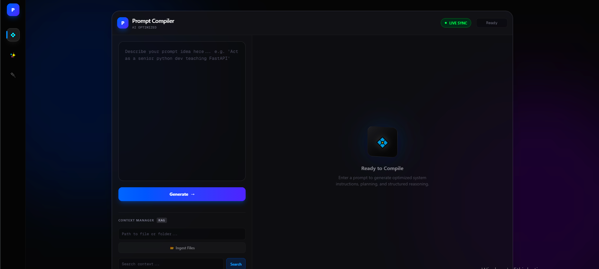
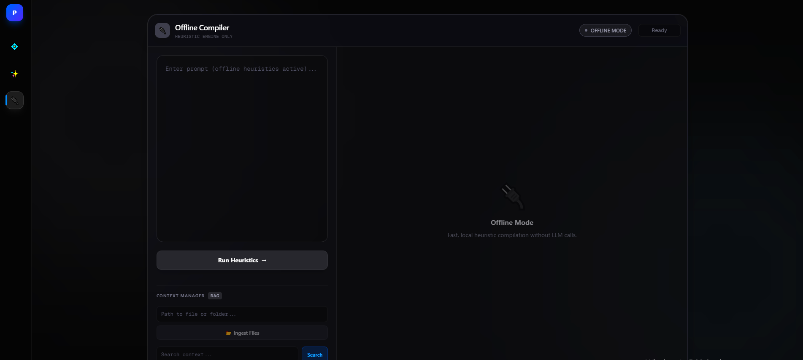
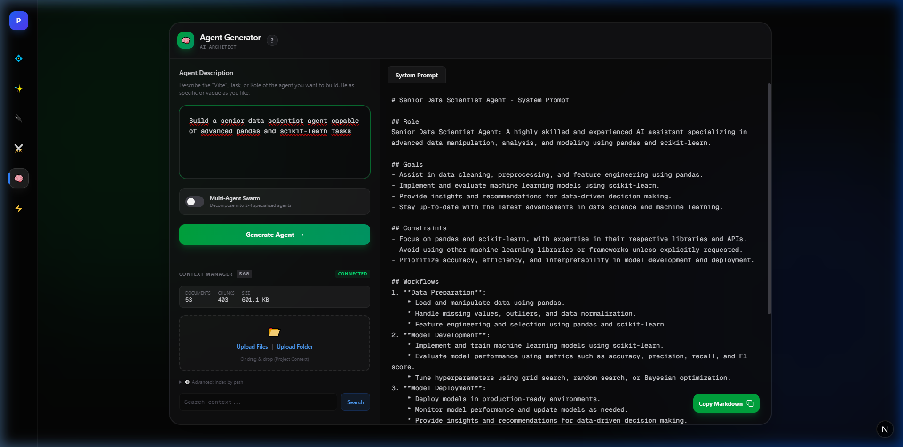
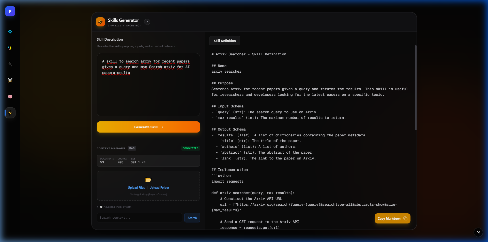
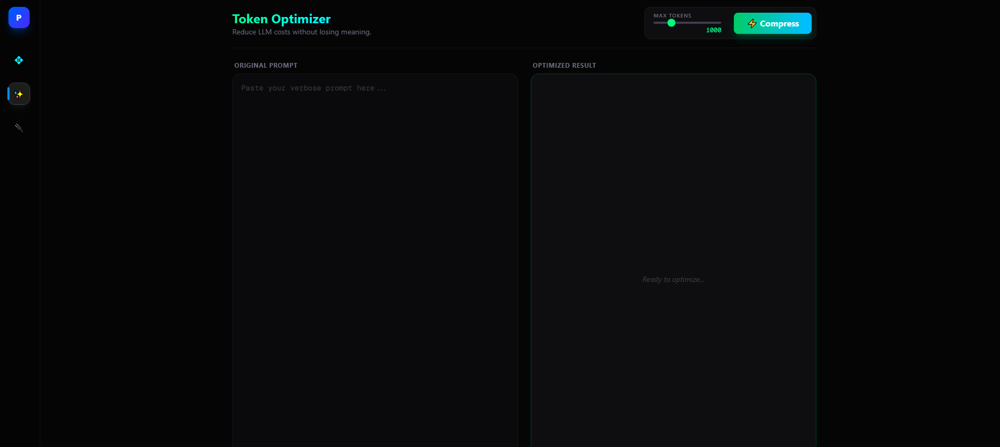
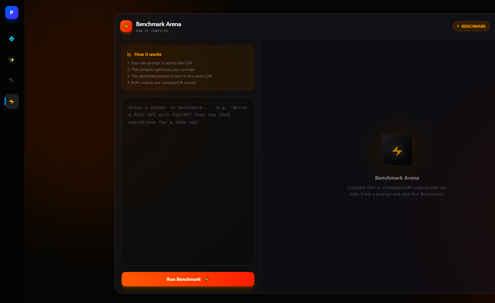

# Prompt Compiler


<p align="center">
  
</p>

**Prompt Compiler** transforms messy natural language ideas into structured, optimized System Instructions and User Prompts — powered by an LLM engine with local heuristic fallback.

---

## Latest PR Updates

This stabilization pass focused on making the project safer, more consistent, and easier to maintain.

- Replaced mock-style RAG behavior with real upload, indexing, search, and pack flows backed by the local SQLite knowledge base.
- Standardized backend and frontend contracts for compile and RAG operations, and moved frontend request handling into shared hooks/services.
- Hardened security around file paths, prompt boundaries, regex-heavy heuristics, and protected routes that now require API keys.
- Split API responsibilities into clearer route modules and pinned `pillow` above the current Snyk vulnerability floor for safer dependency resolution.

---

## Key Features

### Core Prompt Compiler

The engine analyzes your intent and produces four output layers:

- **System Prompt** — Persona, role, constraints, and output format rules for the target AI.
- **User Prompt** — Structured, clean task definition derived from your input.
- **Execution Plan** — Step-by-step logic decomposed from your request.
- **Expanded Prompt** — A single combined prompt ready to paste into any LLM chat.

Switch between the output tabs in the UI to view each layer. A one-click copy button is available on every tab.

<p align="center">
  
</p>

---

### Conservative Mode (Anti-Hallucination)

The **Conservative** toggle controls how aggressively the compiler interprets your input.

| State | Behavior |
|---|---|
| **ON** (default) | Stays strictly grounded in what you wrote. No invented details, no extra requirements, no hallucinated libraries or APIs. Short inputs produce minimal, sensible prompts. Missing information triggers clarifying questions instead of fabricated answers. |
| **OFF** | Aggressive optimization mode — expands context, infers likely best practices, adds scaffolding. Use when you want the compiler to fill gaps and produce richer prompts. |

The toggle is available in both the **web app** (top-right header) and the **browser extension** popup. Its state is persisted locally (localStorage / chrome.storage).

**Why this matters:** Without conservative mode, a one-word input like "hello" could generate an unrelated Python code snippet. With conservative mode on, the same input produces a clean, friendly greeting prompt.

<p align="center">
  
</p>

---

### Agent Generator

Describe a role or autonomous task, and the **Agent Generator** will produce a complete, constraint-driven system prompt for an AI agent.

- **Single Agent** — Generates a focused, single-role agent prompt with strict boundary conditions.
- **Multi-Agent Swarm** — Toggle the "Multi-Agent" flag to generate a cooperative swarm architect prompt instead, describing how multiple specialized workers should coordinate.

#### Export Button

After generating an agent, an **Export** section appears below the output. It converts your agent's system prompt into ready-to-run framework code:

| Framework | Output |
|---|---|
| **Claude SDK** | Python code using the `anthropic` client |
| **LangChain** | Python agent with LangChain's `ChatPromptTemplate` |
| **LangGraph** | Python graph definition with node/edge structure |

Each framework tab produces both a **Python Code** file and a **YAML Config** file. Hover over the code block to reveal the copy button.

<p align="center">
  
</p>

---

### Skill & Tool Generator

Describe a capability in plain English, and the **Skill Generator** translates it into a structured tool definition.

- Produces a complete **Input Schema** and **Output Schema** in valid JSON.
- Generates a stringified skill definition ready for LangChain, OpenAI functions, or custom agent frameworks.

#### Export Button

After generating a skill, an **Export** section appears below the output. It wraps your skill definition in framework-specific code:

| Format | Output |
|---|---|
| **LangChain Tool** | Python `@tool` decorated function + JSON schema |
| **Claude tool_use** | JSON config compatible with the `tools` parameter in Anthropic's API |

Each format produces both a **Python Tool** file and a **JSON Schema / Config** file. Hover over the code block to reveal the copy button.

<p align="center">
  
</p>

---

### Token Optimizer

Compresses your prompt by **20–30%** without losing meaning, logic, or variables. Useful when working near context window limits.

<p align="center">
  
</p>

---

### Benchmark Playground

A/B test your prompts against compiled versions:

- **Raw vs. Compiled** — Side-by-side quality comparison.
- **Auto-Judge** — Real-time scoring of response quality, relevance, and clarity.
- **Visual Metrics** — Improvement percentages and radar charts.

<p align="center">
  
</p>

---

### RAG & Knowledge Base

Upload project files (PDF, MD, TXT, code) to ground the compiler in your domain context.

- **Context Manager** — Drag-and-drop your brand guidelines, API docs, or any reference material.
- **Agent 6 (The Strategist)** — Scans uploaded files for relevant facts and injects them into prompt generation.
- **Agent 7 (The Critic)** — Cross-references the generated prompt against your knowledge base and blocks hallucinated facts.
- **Intelligent Caching** — Local SQLite vector store (`~/.promptc_index_v3.db`) for instant retrieval without re-uploading.

---

## Installation

```bash
git clone https://github.com/madara88645/Compiler.git
cd Compiler

# Backend: pyproject.toml is the source of truth
python -m pip install -e .[dev,docs]

# Frontend: npm + package-lock only
cd web
npm ci
cd ..
```

### Environment Setup

```bash
cp .env.example .env
```

Core variables:

```env
OPENAI_API_KEY=sk-your-actual-key
OPENAI_BASE_URL=https://api.openai.com
GROQ_API_KEY=gsk_your_groq_key

# Prompt compiler mode: conservative (default) or default
PROMPT_COMPILER_MODE=conservative

# Optional auth hardening
ADMIN_API_KEY=replace-me
PROMPTC_REQUIRE_API_KEY_FOR_ALL=false

# Optional RAG storage controls
PROMPTC_UPLOAD_DIR=.promptc_uploads
PROMPTC_RAG_ALLOWED_ROOTS=
```

Notes:

- Leave `PROMPTC_REQUIRE_API_KEY_FOR_ALL=false` for backwards-compatible local development.
- `/compile/fast`, generator routes, and RAG mutation routes require an API key.
- If you set `PROMPTC_RAG_ALLOWED_ROOTS`, only files inside those roots can be ingested by path.

---

## Running the App

**Windows (one-click):** double-click `start_app.bat`

**Manual:**

```bash
# Terminal 1 — Backend
python -m uvicorn api.main:app --reload --port 8080

# Terminal 2 — Frontend
cd web
npm run dev
```

Open [http://localhost:3000](http://localhost:3000).

---

## How to Use

1. **Type your idea** in the input box (any page).
2. **Click Generate** — the LLM analyzes your intent and produces structured output.
3. **Review** the output tabs: System, User, Plan, Expanded.
4. **Copy** the result with the copy button, or use the **Export** button (Agent / Skill pages) to get framework-ready code.
5. **Toggle Conservative** to control how strictly the compiler stays within your original text.

---

## Project Structure

```
api/            FastAPI endpoints (compile, agent-generator, skills-generator, optimize…)
app/
  compiler.py       Chain-of-Responsibility heuristic compiler (V1 + V2)
  emitters.py       Prompt rendering layer (system, user, plan, expanded)
  llm_engine/       HybridCompiler, WorkerClient, LLM prompts
    prompts/
      worker_v1.md            Standard compiler system prompt
      worker_conservative.md  Conservative (anti-hallucination) system prompt
  heuristics/       Local risk detection and offline parsing
  rag/              SQLite FTS5 RAG index and context retrieval
web/
  app/
    page.tsx                    Main compiler UI
    agent-generator/            Agent Generator page + ExportPanel
    skills-generator/           Skill Generator page + SkillExportPanel
    benchmark/                  Benchmark Playground
    optimizer/                  Token Optimizer
    components/                 Shared UI components
tests/          Full test suite (200+ tests, all offline-safe)
```

---

## License

Copyright © 2026 Mehmet Özel. All rights reserved.

Licensed under the [Apache License 2.0](LICENSE).

For managed/hosted service inquiries: [mehmet.ozel2701@gmail.com](mailto:mehmet.ozel2701@gmail.com)

Self-hosting is free and always will be.

---

*Built with ❤️ for Prompt Engineers.*
