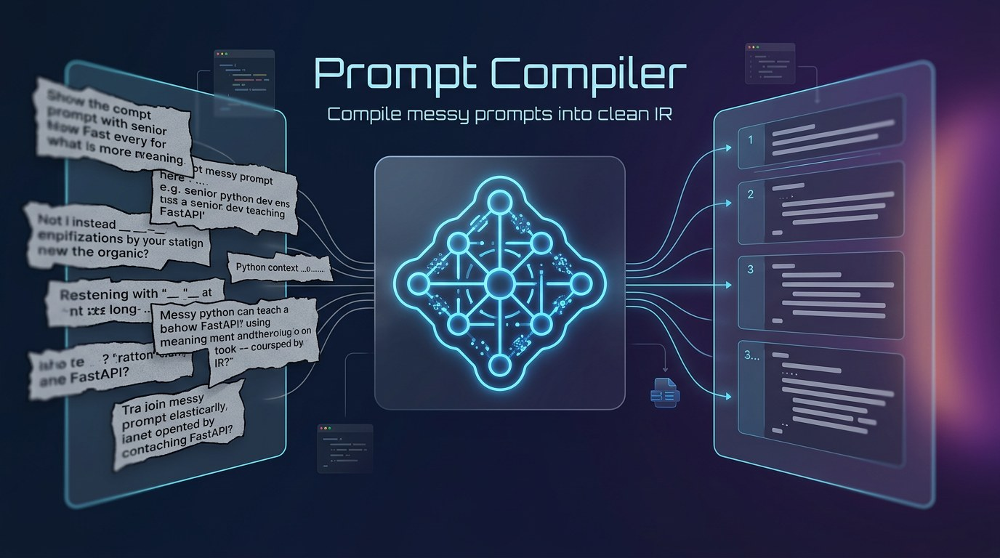

# Prompt Compiler


<p align="center">
  
</p>

**Prompt Compiler** turns vague requests into structured prompts, execution plans, and policy-checked workflows — so you can go from idea to safe, usable AI output in seconds.

Try it now at [prcompiler.com](https://prcompiler.com) | [VS Code extension](integrations/vscode-extension) | [GitHub artifacts](docs/pattern-library.md)

---

## What It Does

Type any request — a feature idea, a bug report, a research question — and Prompt Compiler produces:

- **System Prompt** — persona, role, constraints, output format
- **User Prompt** — structured task definition
- **Execution Plan** — step-by-step decomposition
- **Expanded Prompt** — ready to paste into any LLM
- **Policy Layer** — risk level, allowed tools, execution mode, data sensitivity

---

## Key Features

### Core Prompt Compiler

The engine analyzes your intent and produces four output layers:

- **System Prompt**: persona, role, constraints, and output format rules for the target AI
- **User Prompt**: structured task definition derived from your input
- **Execution Plan**: decomposed steps based on your request
- **Expanded Prompt**: a combined prompt ready to paste into chat-based LLMs

Switch between the output tabs in the UI to inspect each layer, and copy any result with one click.

<p align="center">
  
</p>

---

### Conservative Mode

The **Conservative** toggle controls how aggressively the compiler interprets your input.

| State | Behavior |
|---|---|
| **ON** (default) | Stays grounded in what you actually wrote. No invented libraries, fake APIs, or made-up requirements. Missing information leads to clarification instead of fabrication. |
| **OFF** | Expands more aggressively, fills gaps, and leans into richer prompt optimization. |

The toggle is available in both the **web app** and the **browser extension**, and its state is persisted locally.

<p align="center">
  
</p>

---

### Policy-Aware Prompt Workflows

Prompt Compiler now also exposes a structured IR and policy layer for more sensitive or execution-heavy requests.

- **Risk Level**: `low`, `medium`, `high`
- **Execution Mode**: `advice_only`, `human_approval_required`, `auto_ok`
- **Data Sensitivity**: `public`, `internal`, `confidential`, `restricted`
- **Allowed / Forbidden Tools**
- **Sanitization Rules**

This is not a separate product. It is a new capability inside Prompt Compiler that helps you inspect risky requests before you run them downstream in coding, research, or automation flows.

---

### Agent Generator

Describe a role or autonomous task, and the **Agent Generator** produces a complete, constraint-driven system prompt for an AI agent.

- **Single Agent**: generates a focused, single-role agent prompt with boundary conditions
- **Multi-Agent Swarm**: toggle the multi-agent mode to generate a cooperative swarm-style prompt for specialized workers

#### Export Button

After generating an agent, the **Export** section can turn the output into framework-ready code:

| Framework | Output |
|---|---|
| **Claude SDK** | Python code using the `anthropic` client |
| **LangChain** | Python agent with `ChatPromptTemplate` |
| **LangGraph** | Python graph definition with node/edge structure |

<p align="center">
  
</p>

---

### Skill & Tool Generator

Describe a capability in plain English, and the **Skill Generator** translates it into a structured tool definition.

- Produces **Input Schema** and **Output Schema** in valid JSON
- Generates a stringified skill definition ready for LangChain, OpenAI functions, or custom agent frameworks

#### Export Button

After generating a skill, the **Export** section can wrap the output in framework-specific code:

| Format | Output |
|---|---|
| **LangChain Tool** | Python `@tool` function plus JSON schema |
| **Claude tool_use** | JSON config compatible with Anthropic's `tools` parameter |

<p align="center">
  
</p>

---

### Token Optimizer

Compresses your prompt by roughly **20-30%** without losing meaning, logic, or variables. Useful near context-window limits.

<p align="center">
  
</p>

---

### Benchmark Playground

A/B test raw prompts against compiled versions:

- **Raw vs. Compiled** side-by-side comparison
- **Auto-Judge** scoring for relevance, quality, and clarity
- **Visual Metrics** including improvement percentages

<p align="center">
  
</p>

---

### RAG & Knowledge Base

Upload project files such as PDF, Markdown, text, or code to ground Prompt Compiler in your own domain context.

- **Context Manager** for drag-and-drop reference files
- **Strategist/Critic flow** for injecting grounded context and catching hallucinated claims
- **Local SQLite-backed retrieval** for fast reuse without re-uploading

---

### GitHub Workflow Artifacts

Prompt Compiler can render deterministic markdown artifacts from natural language requests:

- **Issue Brief**
- **Implementation Checklist**
- **PR Review Brief**

Example:

```bash
python -m cli.main github render --type pr-review-brief --from-file prompt.txt
```

---

### VS Code Extension MVP

The VS Code package lives in [`integrations/vscode-extension`](integrations/vscode-extension). Once the Marketplace publisher is claimed and the first `vscode-v*` tag is pushed, it installs from:

- **VS Code Marketplace** — [`madara88645.promptc-vscode`](https://marketplace.visualstudio.com/items?itemName=madara88645.promptc-vscode)
- **Open VSX** (VSCodium / Cursor) — [`madara88645/promptc-vscode`](https://open-vsx.org/extension/madara88645/promptc-vscode)

Until then, install from source (see [the extension README](integrations/vscode-extension/README.md#local-development)) or the `.vsix` artifact on the `Publish VS Code Extension` workflow run.

Features:

- `PromptC: Compile Selection`
- `PromptC: Open Panel`
- Tabs: `Intent`, `Policy`, `Prompts`, `Raw JSON`
- Settings: `promptc.apiBaseUrl`, `promptc.conservativeMode`

API keys are stored in VS Code secret storage, not workspace settings.

---

## Installation

```bash
git clone https://github.com/madara88645/Compiler.git
cd Compiler

# Backend: pyproject.toml is the source of truth
python -m pip install -e .[dev,docs]

# Frontend
cd web
npm ci
cd ..
```

### Environment Setup

```bash
cp .env.example .env
```

Core variables:

```env
OPENAI_API_KEY=sk-your-actual-key
OPENAI_BASE_URL=https://api.openai.com
GROQ_API_KEY=gsk_your_groq_key

# Prompt compiler mode: conservative (default) or default
PROMPT_COMPILER_MODE=conservative

# Optional auth hardening
ADMIN_API_KEY=replace-me
PROMPTC_REQUIRE_API_KEY_FOR_ALL=false

# Optional RAG storage controls
PROMPTC_UPLOAD_DIR=.promptc_uploads
PROMPTC_RAG_ALLOWED_ROOTS=
```

Notes:

- Leave `PROMPTC_REQUIRE_API_KEY_FOR_ALL=false` for backwards-compatible local development.
- `/compile/fast`, generator routes, and RAG mutation routes require an API key.
- If you set `PROMPTC_RAG_ALLOWED_ROOTS`, only files inside those roots can be ingested by path.

---

## Running the App

**Windows (one-click):** double-click `start_app.bat`

**Manual:**

```bash
# Terminal 1 - Backend
python -m uvicorn api.main:app --reload --port 8080

# Terminal 2 - Frontend
cd web
npm run dev
```

Open [http://localhost:3000](http://localhost:3000).

---

## How To Use

1. Type your idea, prompt, task, or workflow request into the input box.
2. Click **Generate**.
3. Review the output tabs: `Intent`, `System`, `User`, `Plan`, `Expanded`, `JSON`, `Quality`.
4. Use **Conservative** mode when you want grounded output.
5. If the task is sensitive, inspect the policy layer before using the result downstream.
6. Use Agent, Skill, Optimizer, Benchmark, and RAG surfaces as needed.

---

## Project Structure

```text
api/            FastAPI endpoints (compile, agent-generator, skills-generator, optimize, rag)
app/
  compiler.py       Core compiler pipeline
  emitters.py       Prompt rendering layer
  models_v2.py      IR v2 and policy contract
  llm_engine/       HybridCompiler and provider logic
  heuristics/       Offline parsing, safety, risk, and policy inference
  rag/              SQLite FTS5 RAG index and retrieval
  testing/          Regression runner
  github_artifacts.py
web/
  app/
    page.tsx                    Main compiler UI
    agent-generator/            Agent Generator page
    skills-generator/           Skill Generator page
    benchmark/                  Benchmark Playground
    optimizer/                  Token Optimizer
    components/                 Shared UI components
cli/            CLI entrypoints
integrations/
  vscode-extension/
extension/      Browser extension
tests/          Offline-safe test suite
docs/           Product, pattern, and workflow docs
```

---

## Docs

- [`docs/pattern-library.md`](docs/pattern-library.md)
- [`docs/promptc-safe-workflows.md`](docs/promptc-safe-workflows.md)
- [`examples/github/promptc-artifact.yml`](examples/github/promptc-artifact.yml)

---

## License

Copyright © 2026 Mehmet Özel. All rights reserved.

Licensed under the [Apache License 2.0](LICENSE).

For managed/hosted service inquiries: [mehmet.ozel2701@gmail.com](mailto:mehmet.ozel2701@gmail.com)

Self-hosting is free and always will be.
